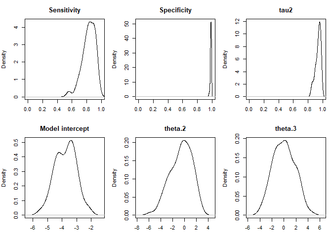
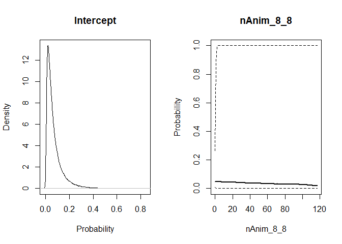

STOCfree: prediction of probabilities of freedom from infection from
longitudinal data
================

  - [Aims](#aims)
  - [Package installation and update](#package-installation-and-update)
  - [Attaching packages](#attaching-packages)
  - [Herd level test results, 1 test, several risk
    factors](#herd-level-test-results-1-test-several-risk-factors)
      - [Example data](#example-data)
      - [The STOCfree\_data class](#the-stocfree_data-class)
      - [Priors for test
        characteristics](#priors-for-test-characteristics)
      - [Priors for infection dynamics](#priors-for-infection-dynamics)
      - [Priors for risk factors of new
        infection](#priors-for-risk-factors-of-new-infection)
      - [Model call](#model-call)
      - [Results](#results)
  - [Other configurations](#other-configurations)
      - [Herd level test results, 1 test, no risk
        factors](#herd-level-test-results-1-test-no-risk-factors)
      - [Herd level test results, several tests, several risk
        factors](#herd-level-test-results-several-tests-several-risk-factors)

# Aims

The aim of the STOCfree package is to predict herd level probabilities
of freedom from infection from longitudinal data collected as part of
surveillance programmes.

Currently, the following types of configurations can be modelled:

  - Herd level test results, 1 test, several risk factors
  - Herd level test results, 1 test, no risk factors
  - Herd level test results, several tests, no risk factors
  - Herd level test results, several tests, several risk factors
  - Animal level test results, one test, no risk factors

# Package installation and update

Before installing the package, you need to make sure that JAGS is
installed. This programme can be installed from the following website:
<https://sourceforge.net/projects/mcmc-jags/files/>.

The easiest way to install the `STOCfree` package is from Github. This
requires installing the `devtool` package first.

``` r
install.packages("devtools")
```

Then load the `devtool` package:

``` r
library(devtools)
```

In order to install (or update) the STOCfree package, run the following
line:

``` r
install_github("AurMad/STOCfree")
```

# Attaching packages

The `STOCfree` package needs to be attached.

``` r
library(STOCfree)
```

The list of available functions and datasets can be accessed by typing

``` r
help(package="STOCfree")
```

We also attach the following packages that will be used later:

``` r
library(ggplot2)
```

# Herd level test results, 1 test, several risk factors

In order to show how to perform the prediction we use the `herdBTM`
dataset which is embedded in the package. In the first example, we
consider the case where we have herd level test results, a single type
of test is performed and 2 risk factors are included.

## Example data

The `herdBTM` dataset contains the results of antibody ELISA tests
performed on bulk tank milk. Each row is a testing date in a herd. There
are 100 herds with 11 tests for each herd.

There are also data for 2 risk factors of new infection:

  - `ln_nOrig6_12` is the number of source herds for cattle purchased
    between 6 and 12 months before the test
  - `LocalSeroPrev` is the municipality level prevalence of seropositive
    herds on the previous round of testing

<!-- end list -->

``` r
head(herdBTM)
```

    ## # A tibble: 6 x 6
    ##   Farm  DateOfTest   ODR TestResult ln_nOrig6_12 LocalSeroPrev
    ##   <chr> <date>     <dbl>      <int>        <dbl>         <dbl>
    ## 1 FR001 2011-09-20  79.2          1            0          0.2 
    ## 2 FR001 2012-01-12  70.5          1            0          0.1 
    ## 3 FR001 2012-09-25  63.9          1            0          0.2 
    ## 4 FR001 2013-02-05  54.2          0            0          0.18
    ## 5 FR001 2013-08-29  75.8          1            0          0.18
    ## 6 FR001 2014-02-04  67.1          1            0          0.12

## The STOCfree\_data class

For running the model the data needs to be put in a special format: the
`STOCfree_data class`. The aim is to help setting the different
parameters required and to help checking the different hypotheses that
are made.

In order to show how to include a categorical risk factor in the model,
we first create a categorical variable called `purch_yn` (for purchase
yes/no) from the `ln_nOrig6_12` variable.

``` r
data(herdBTM)
herdBTM$purch_yn <- ifelse(herdBTM$ln_nOrig6_12 > 0, 1, 0)
herdBTM
```

    ## # A tibble: 1,100 x 7
    ##    Farm  DateOfTest   ODR TestResult ln_nOrig6_12 LocalSeroPrev purch_yn
    ##    <chr> <date>     <dbl>      <int>        <dbl>         <dbl>    <dbl>
    ##  1 FR001 2011-09-20  79.2          1        0              0.2         0
    ##  2 FR001 2012-01-12  70.5          1        0              0.1         0
    ##  3 FR001 2012-09-25  63.9          1        0              0.2         0
    ##  4 FR001 2013-02-05  54.2          0        0              0.18        0
    ##  5 FR001 2013-08-29  75.8          1        0              0.18        0
    ##  6 FR001 2014-02-04  67.1          1        0              0.12        0
    ##  7 FR001 2014-09-10  54.4          0        0              0.1         0
    ##  8 FR001 2015-02-01  47.1          0        0              0.08        0
    ##  9 FR001 2015-09-03  39.8          0        0              0.1         0
    ## 10 FR001 2016-02-18  40.5          0        0.693          0.22        1
    ## # … with 1,090 more rows

The `herdBTM` dataset is put in the `STOCfree_data` using the
`STOCfree_data()`. The function takes the following arguments:

  - `test_data`: a data.frame with test results
  - `test_herd_col`: name of the column containing the herd identifier
  - `test_date_col`: name of the column containing the date of test.
    Should be a data formatted as YYYY-mm-dd.
  - `test_res_col`: name of the column containing test results
  - `test_level`: level of testing. Can be ‘herd’ or ‘animal’ (will be
    implemented soon)
  - `risk_factor_data`: a data.frame containing the risk factor for each
    test. Can be the same dataset as above.
  - `risk_herd_col`: name of the column containing the herd identifier
  - `risk_date_col`: name of the date containing the dates on which risk
    factors act on the probability of new infection
  - `risk_factor_col`: name of the column(s) containing the risk factors
  - `risk_factor_type`: can be ‘categorical’ or ‘continuous’. Should be
    a vector of the same length as ‘risk\_factor\_col’

Below, a dataset with the first 3 herds of the herdBTM dataset is put in
the STOCfree data format.

``` r
sfd <- STOCfree_data(test_data = herdBTM[herdBTM$Farm %in% c("FR001", "FR002", "FR003"),],
                          test_herd_col = "Farm",
                          test_date_col = "DateOfTest",
                          test_res_col = "TestResult",
                          test_level = "herd",
                          risk_factor_data = herdBTM[herdBTM$Farm %in% c("FR001", "FR002", "FR003"),],
                          risk_herd_col = "Farm",
                          risk_date_col = "DateOfTest",
                          risk_factor_col = c("purch_yn", "LocalSeroPrev"),
                          risk_factor_type = c("categorical", "continuous"))
```

## Priors for test characteristics

The model accounts for imperfect tests i.e. with test sensitivity and
specificity that are below one. Hypotheses about the test
characteristics is incorporated in the form of priors with Beta
distributions. The current value for the parameters of these Beta
distributions can be checked with the `show_tests()` function.

``` r
show_tests(sfd)
```

    ##         test test_id Se_a Se_b Sp_a Sp_b
    ## 1 TestResult       1   NA   NA   NA   NA

The values are currently NA and need to be set to reasonable values.

``` r
sfd <- set_priors_tests(sfd,
                 Se_a = 12,
                 Se_b = 2,
                 Sp_a = 200,
                 Sp_b = 4)
```

We can check that the STOCfree\_data object has been updated.

``` r
show_tests(sfd)
```

    ##         test test_id Se_a Se_b Sp_a Sp_b
    ## 1 TestResult       1   12    2  200    4

The `plot_priors_tests()` function is used to plot the priors.

``` r
plot_priors_tests(sfd)
```

<!-- -->

## Priors for infection dynamics

Priors on 2 parameters related to infection dynamics need to be set in
order for the model to work. These are the probability of infection on
the first test and the probability of eliminating the infection for
herds that were infected on the previous month. Both priors are
represented with Beta distributions.

Again, there is a `show_inf_dyn()` that allows displaying the current
values for the prior distributions.

``` r
show_inf_dyn(sfd)
```

    ##  pi1_a  pi1_b tau2_a tau2_b 
    ##     NA     NA     NA     NA

The priors are set:

``` r
sfd <- set_priors_inf_dyn(sfd,
                   pi1_a = 1,
                   pi1_b = 2,
                   tau2_a = 30, 
                   tau2_b = 2)
```

The prior distributions are plotted.

``` r
plot_priors_inf_dyn(sfd)
```

<!-- -->

## Priors for risk factors of new infection

From the information provided when constructin the STOCfree\_data
object, the following risk factors have been listed:

``` r
show_rf(sfd)
```

    ##     risk_factor        type modality ref
    ## 1     Intercept   intercept       NA   0
    ## 2      purch_yn categorical        1   0
    ## 3 LocalSeroPrev  continuous       NA   0

The association between these risk factors and the probability of new
infection between consecutive month is represented by normal
distributions on a logit scale. The mean and standard deviation of these
distributions need to be set using the `set_priors_rf()` function. The
function needs to be used for each parameter in turn.

``` r
sfd <- set_priors_rf(sfd,
                   risk_factor = "Intercept",
                   mean = -2, sd = 1)

sfd <- set_priors_rf(sfd,
                   risk_factor = "LocalSeroPrev",
                   mean = 0, sd = 2)

sfd <- set_priors_rf(sfd,
                   risk_factor = "purch_yn",
                   modality = 1,
                   mean = 0, sd = 2)

show_rf(sfd)
```

    ##     risk_factor        type modality ref mean_prior sd_prior
    ## 1     Intercept   intercept       NA   0         -2        1
    ## 2      purch_yn categorical        1   0          0        2
    ## 3 LocalSeroPrev  continuous       NA   0          0        2

The distributions for these priors can then be plotted using the
`plot_priors_rf()` function.

``` r
plot_priors_rf(sfd)
```

<!-- -->

The STOCfree\_data object is now ready to be modelled.

## Model call

The model is run in JAGS. Before extracting samples from the parameter
posterior distributions, it is first compiled. The function takes a
STOCfree\_data object as first argument as well as the number of chains
wanted.

``` r
compiled_model <- compile_JAGS(sfd, n_chains = 4)
```

    ## Compiling model graph
    ##    Resolving undeclared variables
    ##    Allocating nodes
    ## Graph information:
    ##    Observed stochastic nodes: 32
    ##    Unobserved stochastic nodes: 196
    ##    Total graph size: 1914
    ## 
    ## Initializing model

Samples from the posterior distributions of model parameters, predicted
probabilities of infection and predicted statuses are drawn using the
`sample_model()` function.

``` r
samples <- sample_model(compiled_model, 
                        n_burnin = 100, 
                        n_iter = 100, 
                        n_thin = 5)
```

## Results

The model retruns a list with 2 components:

  - samples from the model parameters posterior distributions
  - samples from the predicted probability of infection posterior
    distributions

### Model parameters

The samples from the model parameter posterior distributions are in the
`parameters` component of the variable in which we have stored the model
results. We put them in a new variable called `param` to explore these
distributions.

``` r
param <- samples$parameters

param
```

    ## # A tibble: 80 x 9
    ##    .chain .iteration .draw    Se    Sp  tau2 theta.1 theta.2 theta.3
    ##     <int>      <int> <int> <dbl> <dbl> <dbl>   <dbl>   <dbl>   <dbl>
    ##  1      1          1     1 0.801 0.986 0.938   -4.05  -1.73  -1.04  
    ##  2      1          2     2 0.877 0.993 0.951   -3.82   1.53  -1.97  
    ##  3      1          3     3 0.952 0.975 0.972   -4.19  -2.58  -1.94  
    ##  4      1          4     4 0.932 0.967 0.948   -4.27   0.686  0.0523
    ##  5      1          5     5 0.877 0.979 0.953   -5.13  -2.74  -3.53  
    ##  6      1          6     6 0.830 0.991 0.949   -4.67  -1.75   0.528 
    ##  7      1          7     7 0.850 0.983 0.949   -3.63   0.887  0.636 
    ##  8      1          8     8 0.709 0.982 0.936   -4.45  -0.622  1.04  
    ##  9      1          9     9 0.838 0.987 0.853   -3.82   2.32  -1.19  
    ## 10      1         10    10 0.822 0.984 0.956   -4.00  -3.08  -1.39  
    ## # … with 70 more rows

The columns of this dataset are:

  - `.chain`: chain number. Between 1 and 4 in the example because we
    ran 4 MCMC chains in JAGS. This number is the value we selected for
    `n_chains` in the call to `compile_JAGS`.
  - `.iteration`: iteration number. Defined by the n\_iter value in the
    call to sample\_model
  - `.draw`: number of iterations from the first iteration in chain 1,
    pooling all the chains
  - `Se`: sample for sensitivity for this draw
  - `Sp`: sample for pecificity for this draw
  - `tau2`: sample for tau2 for this draw
  - `theta.1`: sample for the logistic model intercept for this draw
  - `theta.2`: sample for the coefficient associated with the first risk
    factor for this draw
  - `theta.3`: sample for the coefficient associated with the second
    risk factor for this draw

<!-- -->

### Probability of infection

The samples from posterior distributions of the predicted probabilities
of infection are in the `proba_inf` component of the variable in which
we have stored the model results. We put them in a new variable called
`proba_inf` to explore these distributions.

``` r
proba_inf <- samples$proba_inf

proba_inf
```

    ## # A tibble: 240 x 6
    ## # Groups:   herd_id [3]
    ##    .chain .iteration .draw herd_id predicted_proba predicted_status
    ##     <int>      <int> <int>   <int>           <dbl>            <dbl>
    ##  1      1          1     1       1        0.0171                  0
    ##  2      1          1     1       2        0.00301                 0
    ##  3      1          1     1       3        0.0171                  0
    ##  4      1          2     2       1        0.0215                  0
    ##  5      1          2     2       2        0.00207                 0
    ##  6      1          2     2       3        0.0215                  0
    ##  7      1          3     3       1        0.0148                  0
    ##  8      1          3     3       2        0.000565                0
    ##  9      1          3     3       3        0.0148                  0
    ## 10      1          4     4       1        0.0138                  0
    ## # … with 230 more rows

The first columns of this dataset are the same as above. The following
columns differ:

  - `herd_id`: herd identifier
  - `predicted_proba`: predicted probability of infection on this draw
  - `predicted_status`: predicted status regarding infection on this
    draw. This status was simulated by using `predicted_proba` for this
    draw as the proportion parameter in a Bernoulli distribution.

Below we represent the densities for the predicted probabilities of
infection for both the draws predicted as infected and the draws
predicted as uninfected. From this, a rule to categorise herds as free
from infection or not needs to be created.

``` r
cols <- hcl(h = c(120, 0), c = 100, l = 85)

ggplot(proba_inf, aes(x = predicted_proba, colour = factor(predicted_status))) +
  geom_density() +
  xlim(0, 1) +
  xlab("Predicted probability of infection") +
  scale_color_manual(labels = c("Uninfected", "Infected"), values = cols) +
  guides(colour = guide_legend(title="Predicted status"))
```

<!-- -->

Below are the probability densities for each of the herds modelled. Each
color represents a herd.

``` r
ggplot(proba_inf, aes(x = predicted_proba, colour = factor(herd_id))) +
  geom_density() +
  xlim(0, 1) +
  xlab("Predicted probability of infection") +
  theme(legend.position="none")
```

<!-- -->

The steps envisonned to categorise herds as free from infection are:

  - define a summary for each density, e.g. 5th percentile of the
    predicted probability of infection
  - choose a cut-off to define freedom from infection, e.g. categorise
    herds with the 5th percentile below 0.1 as free from infection

# Other configurations

## Herd level test results, 1 test, no risk factors

When there are no useful risk factor information, the STOCfree\_data
function can be called with test results only.

``` r
sfd1 <- STOCfree_data(test_data = herdBTM[herdBTM$Farm %in% c("FR001", "FR002", "FR003"),],
                          test_herd_col = "Farm",
                          test_date_col = "DateOfTest",
                          test_res_col = "TestResult",
                          test_level = "herd")
```

As before, the priors for test charcateristics need to be set.

``` r
sfd1 <- set_priors_tests(
  x = sfd1,
  Se_a = 12,
  Se_b = 2,
  Sp_a = 200,
  Sp_b = 4)
```

The priors for infection dynamics are also set. In this case, because
there is no risk factor, a prior distribution has to be defined for the
probability of new infection.

``` r
sfd1 <- set_priors_inf_dyn(sfd,
                   pi1_a = 1,
                   pi1_b = 2,
                   tau1_a = 10,
                   tau1_b = 1,
                   tau2_a = 30, 
                   tau2_b = 2)

show_inf_dyn(sfd1)
```

    ##  pi1_a  pi1_b tau2_a tau2_b 
    ##      1      2     30      2

The model is compiled and run as above.

``` r
compiled_model <- compile_JAGS(sfd1, n_chains = 4)
```

    ## Compiling model graph
    ##    Resolving undeclared variables
    ##    Allocating nodes
    ## Graph information:
    ##    Observed stochastic nodes: 32
    ##    Unobserved stochastic nodes: 196
    ##    Total graph size: 1914
    ## 
    ## Initializing model

``` r
samples <- sample_model(compiled_model, 
                        n_burnin = 100, 
                        n_iter = 100, 
                        n_thin = 5)
```

## Herd level test results, several tests, several risk factors

The model also works if different tests with different sensitivities and
specificities are used. To demonstrate how this works, we add a second
test:

``` r
set.seed(123)
herdBTM$TestUsed <- c("ELISA1", "ELISA2")[rbinom(nrow(herdBTM), 1, .7) + 1]
```

In this case, the `test_name_col` argument is used to specify in which
column the test used is stored.

``` r
sfd2 <- STOCfree_data(test_data = herdBTM[herdBTM$Farm %in% c("FR001", "FR002", "FR003"),],
                          test_herd_col = "Farm",
                          test_date_col = "DateOfTest",
                          test_res_col = "TestResult",
                          test_level = "herd",
                          test_name_col = "TestUsed", 
                          risk_factor_data = herdBTM[herdBTM$Farm %in% c("FR001", "FR002", "FR003"),],
                          risk_herd_col = "Farm",
                          risk_date_col = "DateOfTest",
                          risk_factor_col = c("purch_yn", "LocalSeroPrev"),
                          risk_factor_type = c("categorical", "continuous"))
```

A list of test with parameters for their prior distributions is created
automatically.

``` r
show_tests(sfd2)
```

    ##     test test_id Se_a Se_b Sp_a Sp_b
    ## 1 ELISA1       1   NA   NA   NA   NA
    ## 2 ELISA2       2   NA   NA   NA   NA

``` r
sfd2 <- set_priors_tests(
  x = sfd2,
  test = "ELISA1",
  Se_a = 12,
  Se_b = 2,
  Sp_a = 200,
  Sp_b = 4)

sfd2 <- set_priors_tests(
  x = sfd2,
  test = "ELISA2",
  Se_a = 20,
  Se_b = 1,
  Sp_a = 100,
  Sp_b = 2)

plot_priors_tests(sfd2)
```

<!-- -->

Priors for infection dynamics.

``` r
sfd2 <- set_priors_inf_dyn(sfd2,
                   pi1_a = 1,
                   pi1_b = 2,
                   tau2_a = 30, 
                   tau2_b = 2)
```

Priors for associations between risk factors and probability of new
infection.

``` r
sfd2 <- set_priors_rf(sfd2,
                   risk_factor = "Intercept",
                   mean = -2, sd = 1)

sfd2 <- set_priors_rf(sfd2,
                   risk_factor = "LocalSeroPrev",
                   mean = 0, sd = 2)

sfd2 <- set_priors_rf(sfd2,
                   risk_factor = "purch_yn",
                   modality = 1,
                   mean = 0, sd = 2)
```

The model is compiled and run as above.

``` r
compiled_model <- compile_JAGS(sfd2, n_chains = 4)
```

    ## Compiling model graph
    ##    Resolving undeclared variables
    ##    Allocating nodes
    ## Graph information:
    ##    Observed stochastic nodes: 32
    ##    Unobserved stochastic nodes: 198
    ##    Total graph size: 1955
    ## 
    ## Initializing model

``` r
samples <- sample_model(compiled_model, 
                        n_burnin = 100, 
                        n_iter = 100, 
                        n_thin = 5)
```
