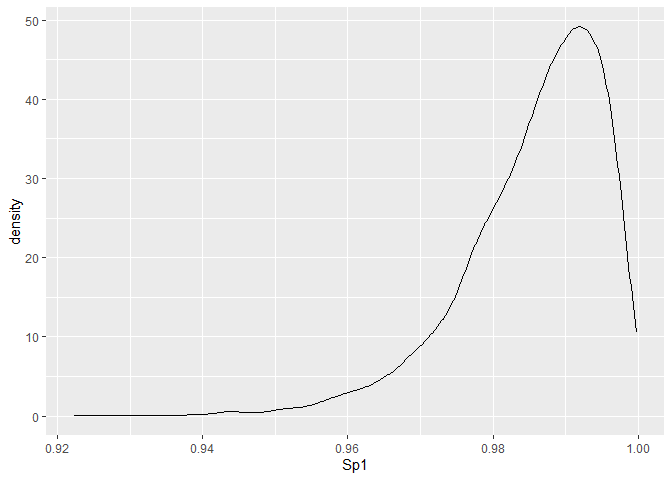
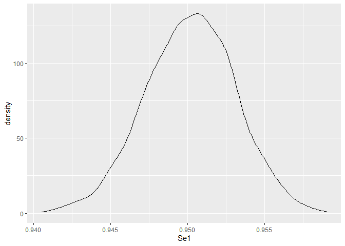

STOCfree: prediction of probabilities of freedom from infection from
longitudinal data
================

-   [Overview](#overview)
-   [Package installation and update](#package-installation-and-update)
-   [Attaching packages](#attaching-packages)
-   [Steps of the analysis](#steps-of-the-analysis)
-   [Test data](#test-data)
-   [Priors for test characteristics](#priors-for-test-characteristics)
-   [Priors for the model parameters related to status
    dynamics](#priors-for-the-model-parameters-related-to-status-dynamics)
-   [Running the STOC free model in
    Stan](#running-the-stoc-free-model-in-stan)
-   [Running the STOC free model in
    JAGS](#running-the-stoc-free-model-in-jags)
-   [Model results](#model-results)
-   [Inclusion of risk factors](#inclusion-of-risk-factors)

# Overview

The aim of the `STOCfree` package is to predict herd level probabilities
of freedom from infection from longitudinal data collected as part of
surveillance programmes. A full description of the model principles is
available as an
[article](https://www.biorxiv.org/content/10.1101/2020.07.10.197426v1),
which has not yet been peer-reviewed.

It has been developed as part of the EFSA funded project [STOC
free](https://www.stocfree.eu/). An overall description of the project
can be found in a [2019 article by van Roon et
al.](https://www.frontiersin.org/articles/10.3389/fvets.2019.00133/full)
published in frontiers in Veterinary Science.

The problem addressed is the following. For some major infectious
diseases of cattle, there exist local surveillance programmes aimed at
identifying infected herds or animals with the ultimate goal of
controlling or eradicating the disease. Although such programmes usually
lead to disease control or eradication, they can create some difficulty
when trading animals. Herds considered as free from infection within one
programme may not be considered free under another programme. This lack
of comparability can be problematic. This is due to the differences in
the programmes in terms of the frequency of testing, the categories of
the animals tested, the tests used… as well as in the way freedom from
infection is defined from the data collected. The aim of the STOC free
project is to provide a framework allowing the comparison of the outputs
generated by different surveillance programmes. This is known as
output-based surveillance.

In the STOC free project, infection by the Bovine Viral Diarrhoea Virus
(BVDV) in cattle is taken as an example. A [description of BVDV
surveillance
programmes](https://www.sciencedirect.com/science/article/pii/S0022030220301697)
in the countries involved in the project was published by van Roon et
al. in the Journal of Dairy Science in 2020 and shows the variety in
existing programmes.

The statistical framework described on this page is meant to model
surveillance programmes in which all herds in the programme are tested
at regular time intervals. The model can be described as a Hidden Markov
Model, running at the month level. The variable of interest is a latent
status regarding infection that is imperfectly measured with tests and
that can be predicted by risk factors. The model returns a herd level
posterior distribution for the probability of being status positive
given a sequence of test results and risk factors. This probability of
being positive to the status (usually infection) is predicted for the
last month in the dataset. Data collected before are used as historical
data to train the model. Risk factors of new infection (more broadly of
becoming status positive) are considered. The model is run in a Bayesian
framework with estimation and prediction performed in either
[Stan](https://mc-stan.org/) or
[JAGS](http://mcmc-jags.sourceforge.net/). The model runs faster and
better in Stan.

The next sections describe how to install the package, set up and run
the model.

# Package installation and update

Before installing the STOCfree package, you need to install either Stan
or JAGS.

-   The Stan implementation relies on an interface called
    [CmdStan](https://mc-stan.org/users/interfaces/cmdstan) which
    communicates with R through the
    [CmdStanR](https://mc-stan.org/cmdstanr/) R package. The
    instructions to install both CmdStan and CmdStanR can be found on
    the following page:
    <https://mc-stan.org/cmdstanr/articles/cmdstanr.html>. Running the
    Stan model also requires installing the
    [posterior](https://github.com/stan-dev/posterior) R package.

-   JAGS can be installed from the following website:
    <https://sourceforge.net/projects/mcmc-jags/files/>. If R cannot
    find JAGS upon calling `STOCfree_JAGS()` try running the following
    in the console `Sys.setenv(JAGS_HOME=“PATH/JAGS installation”)`.

The `STOCfree` package needs to be installed from Github. This requires
installing the `devtool` package first. You will need R version 3.6 or
later to install the package. You may be asked to install or update
several packages during the installation.

``` r
install.packages("devtools")
```

Then load the `devtool` package:

``` r
library(devtools)
```

In order to install (or update) the STOCfree package, run the following
line:

``` r
install_github("AurMad/STOCfree")
```

# Attaching packages

The `STOCfree` package needs to be attached.

``` r
library(STOCfree)
```

The list of available functions and datasets can be accessed by typing

``` r
help(package="STOCfree")
```

We also attach the following packages that will be used later:

``` r
library(ggplot2)
```

# Steps of the analysis

Modelling will usually consist in the following steps:

1.  Set up the test data
2.  Define the prior distributions for test characteristics
3.  Define the prior distributions for the model parameters related to
    status
4.  Set up the risk factor data
5.  Define the prior distributions for the association between risk
    factors and probability of becoming infected (status positive)
6.  Run the STOC free model
7.  Analyse the model outputs

# Test data

## Example dataset

We demonstrate the use of the package by using a toy dataset called
`herdBTM` which is included in the package. These are not real data and
should not be used to draw any conclusion regarding BVD. This dataset
contains the results of tests performed in 100 herds. Two different
tests are used. The first test is an antibody ELISA performed on bulk
tank milk. When this test is positive, a confirmatory test with a high
specificity is performed one month later. The result of the ELISA test
is an optical density ratio (continuous) which is converted into a
negative or positive test result based on a threshold of 35. The dataset
looks as follows:

``` r
head(herdBTM)
```

    ## # A tibble: 6 x 6
    ##   Farm  DateOfTest   ODR Test    TestResult LocalSeroPrev
    ##   <chr> <date>     <dbl> <chr>        <dbl>         <dbl>
    ## 1 FR001 2014-02-04  57.6 BTM_ODR          1          0.12
    ## 2 FR001 2014-03-01  NA   confirm          1          0.12
    ## 3 FR001 2014-09-10  66.5 BTM_ODR          1          0.1 
    ## 4 FR001 2014-10-01  NA   confirm          1          0.1 
    ## 5 FR001 2015-02-01  52.5 BTM_ODR          1          0.08
    ## 6 FR001 2015-03-01  NA   confirm          1          0.08

The columns of the dataset correspond to:

-   `Farm`: farm ID
-   `DateOfTest`: date when the test was performed
-   `ODR`: optical density ratio associated with ELISA test
-   `Test`: type of test used, either routine ELISA on bulk tank milk
    (“BTM\_ODR”) or confirmatory test (“confirm”)
-   `TestResult`: test result. 0 for negative; 1 for positive
-   `LocalSeroPrev`: local seroprevalence, a risk factor of new
    infection

## `STOCfree_data` objects

All the later analyses rely on the construction of a `STOCfree_data`
object. As an example, a `STOCfree_data` object is constructed from the
`herdBTM` dataset. To create this object, we use the `STOCfree_data()`
function. Type `?STOCfree_data` in the console to see the list of
arguments that can be used.

``` r
sfd <- STOCfree_data(test_data = herdBTM,
                     test_herd_col = "Farm",
                     test_date_col = "DateOfTest",
                     test_res_col = "TestResult",
                     test_name_col = "Test",
                     test_level = "herd",
                     status_dynamics_scale = "proba")
```

In this example, the function will gather the test data from the
`herdBTM` dataset, which must be a data.frame or a tibble. Herd
identifiers are looked up in the `Farm` column of the `herdBTM` dataset,
dates of test in the `DateOfTest` column…

One argument worth mentioning is the `status_dynamics_scale` argument.
By default, infection dynamics parameters, i.e. probabilities of
infection on the first time step, acquiring and eliminating the
infection between time steps, are modelled on the probability scale
using Beta distributions (`status_dynamics_scale = "proba"`). Changing
to `status_dynamics_scale = "logit"`, these probabilities are modelled
on the logit scale and normal prior distributions are used. In order to
illustrate this point, we create a second STOCfree\_data object with
dynamics parameters on the logit scale.

``` r
sfd1 <- STOCfree_data(test_data = herdBTM,
                     test_herd_col = "Farm",
                     test_date_col = "DateOfTest",
                     test_res_col = "TestResult",
                     test_name_col = "Test",
                     test_level = "herd",
                     status_dynamics_scale = "logit")
```

The `STOCfree_data()` function returns an object of class
`STOCfree_data`.

``` r
class(sfd)
```

    ## [1] "herd"          "STOCfree_data"

A `STOCfree_data` object is in fact a list of `data.frames`. Below we
provide a brief explanation on the content of this list.

``` r
str(sfd)
```

    ## List of 8
    ##  $ var_names       : Named chr [1:4] "Farm" "DateOfTest" "TestResult" "Test"
    ##   ..- attr(*, "names")= chr [1:4] "test_herd_col" "test_date_col" "test_res_col" "test_name_col"
    ##  $ herd_id_corresp :'data.frame':    100 obs. of  2 variables:
    ##   ..$ Farm   : chr [1:100] "FR001" "FR002" "FR003" "FR004" ...
    ##   ..$ herd_id: int [1:100] 1 2 3 4 5 6 7 8 9 10 ...
    ##  $ test_data       :'data.frame':    924 obs. of  6 variables:
    ##   ..$ status_id  : int [1:924] 1 2 8 9 13 14 20 21 25 26 ...
    ##   ..$ herd_id    : int [1:924] 1 1 1 1 1 1 1 1 1 1 ...
    ##   ..$ month_id   : int [1:924] 1 2 8 9 13 14 20 21 25 26 ...
    ##   ..$ status_type: num [1:924] 1 2 2 2 2 2 2 2 2 2 ...
    ##   ..$ test_id    : int [1:924] 1 2 1 2 1 2 1 2 1 2 ...
    ##   ..$ test_res   : num [1:924] 1 1 1 1 1 1 1 0 1 0 ...
    ##  $ herd_test_data  :'data.frame':    100 obs. of  3 variables:
    ##   ..$ herd_id: int [1:100] 1 2 3 4 5 6 7 8 9 10 ...
    ##   ..$ ind_i  : int [1:100] 1 34 67 100 133 166 199 232 265 298 ...
    ##   ..$ ind_p  : int [1:100] 33 66 99 132 165 198 231 264 297 330 ...
    ##  $ test_perf_prior :'data.frame':    2 obs. of  6 variables:
    ##   ..$ test   : chr [1:2] "BTM_ODR" "confirm"
    ##   ..$ test_id: int [1:2] 1 2
    ##   ..$ Se_a   : logi [1:2] NA NA
    ##   ..$ Se_b   : logi [1:2] NA NA
    ##   ..$ Sp_a   : logi [1:2] NA NA
    ##   ..$ Sp_b   : logi [1:2] NA NA
    ##  $ risk_factors    :'data.frame':    1 obs. of  3 variables:
    ##   ..$ risk_factor: chr "Intercept"
    ##   ..$ type       : chr "intercept"
    ##   ..$ modality   : logi NA
    ##  $ risk_factor_data:'data.frame':    3300 obs. of  4 variables:
    ##   ..$ status_id: int [1:3300] 1 2 3 4 5 6 7 8 9 10 ...
    ##   ..$ herd_id  : int [1:3300] 1 1 1 1 1 1 1 1 1 1 ...
    ##   ..$ month_id : int [1:3300] 1 2 3 4 5 6 7 8 9 10 ...
    ##   ..$ intercept: num [1:3300] 1 1 1 1 1 1 1 1 1 1 ...
    ##  $ inf_dyn_priors  : Named logi [1:6] NA NA NA NA NA NA
    ##   ..- attr(*, "names")= chr [1:6] "pi1_a" "pi1_b" "tau1_a" "tau1_b" ...
    ##  - attr(*, "level")= chr "herd"
    ##  - attr(*, "status dynamics scale")= chr "proba"
    ##  - attr(*, "number of herds")= int 100
    ##  - attr(*, "number of tests")= int 2
    ##  - attr(*, "month first test")= chr "2014-02"
    ##  - attr(*, "month last test")= chr "2016-10"
    ##  - attr(*, "number of risk factors")= num 0
    ##  - attr(*, "class")= chr [1:2] "herd" "STOCfree_data"

The list components are:

-   `var_names`: correspondence between column names in the original
    datasets and relevant data used in the models
-   `herd_id_corresp`: for the analysis herds are numbered from 1 to the
    number of herds. This table contains the correspondence between
    these IDs and the original IDs
-   `test_data`: data with test results
-   `herd_test_data`: herd level indices in the sequence of all months
    for all herds used in the model. For each herd, the model needs the
    indices associated with the first, second, penultimate and last
    tests in the sequence.
-   `test_perf_prior`: table with parameters for the prior distributions
    for test characteristics.
-   `risk_factors`: list and type of risk factors that will be included
    in the model
-   `risk_factor_data`: dataset containing risk factor values for all
    herds and all months in the analysis
-   `inf_dyn_priors`: table with priors for infection dynamics:
    probability of being status positive on the first month, probability
    of becoming status positive between consecutive months when
    applicable, probability of not eliminating the infection between
    consecutive months

# Priors for test characteristics

The model accounts for the fact that the sensitivity and specificity of
the different tests used can be below 1. Hypotheses about these
parameters are included through the use of Beta distributions as priors
for the different sensitivities and specificities. We can check the
current values for the parameters associated with these distributions
using the `show_tests()` function.

``` r
show_tests(sfd)
```

    ##      test test_id Se_a Se_b Sp_a Sp_b
    ## 1 BTM_ODR       1   NA   NA   NA   NA
    ## 2 confirm       2   NA   NA   NA   NA

Column names ending with `_a` and `_b` contain the alpha and beta values
for Beta distributions. For example `Se_a = 20` and `Se_b = 2` define
the prior distribution for sensitivity as Se \~ Beta(20, 2).

As can be seen, no value has been defined yet. This can be done as
follows:

``` r
sfd <- set_priors_tests(sfd,
                 test = "BTM_ODR",
                 Se_a = 5000,
                 Se_b = 260,
                 Sp_a = 20,
                 Sp_b = 2)

sfd <- set_priors_tests(sfd,
                 test = "confirm",
                 Se_a = 20,
                 Se_b = 2,
                 Sp_a = 10000,
                 Sp_b = 1)
```

We can check that the priors have changed:

``` r
show_tests(sfd)
```

    ##      test test_id Se_a Se_b  Sp_a Sp_b
    ## 1 BTM_ODR       1 5000  260    20    2
    ## 2 confirm       2   20    2 10000    1

The prior distributions can be plotted with the `plot_priors_tests()`
function.

``` r
plot_priors_tests(sfd)
```

<!-- -->

In order to help selecting appropriate parameter values for the Beta
distributions, we have designed a Shiny app which is available from
Github. See <https://github.com/AurMad/betadistapp>

# Priors for the model parameters related to status dynamics

These parameters are the probability of being status positive on the
first time step (pi1), the probability of becoming status positive
between consecutive time steps (tau1) and the probability of remaining
status positive between consecutive time steps (tau2). When risk factors
are included in the model, tau1 is modelled as a function of these risk
factors and the parameters for the prior distribution of tau1 will not
be taken into account.

## Probability scale

For `STOCfree_data` objects constructed with the argument
`status_dynamics_scale = "proba"`, the prior distributions for status
dynamics are provided as Beta distributions on the probability scale.
The `show_priors_status_dyn()` shows the current parameter values for
these Beta distributions and gives the syntax the use to change them.

``` r
show_priors_status_dyn(sfd)
```

    ##  pi1_a  pi1_b tau1_a tau1_b tau2_a tau2_b 
    ##     NA     NA     NA     NA     NA     NA

    ## Set prior distributions for status dynamics using:
    ## sfd <- set_priors_status_dyn(sfd, pi1_a = , pi1_b = , tau1_a = , tau1_b = , tau2_a = , tau2_b = )

Parameter values are provided for these prior distributions as follows:

``` r
sfd <- set_priors_status_dyn(sfd,
                   pi1_a = 1,
                   pi1_b = 1,
                   tau1_a = 1.5,
                   tau1_b = 10,
                   tau2_a = 10,
                   tau2_b = 1.5)
```

These distributions can be plotted.

``` r
plot_priors_status_dyn(sfd)
```

<!-- -->

## Logit scale

To demonstrate how to set dynamics parameters on the logit scale, we use
the `sfd1` object created above. As can be seen, the parameter values
requested consist of means and standard deviations.

``` r
show_priors_status_dyn(sfd1)
```

    ##  logit_pi1_mean    logit_pi1_sd logit_tau1_mean   logit_tau1_sd logit_tau2_mean 
    ##              NA              NA              NA              NA              NA 
    ##   logit_tau2_sd 
    ##              NA

    ## Set prior distributions for status dynamics using:
    ## sfd1 <- set_priors_status_dyn(sfd1, logit_pi1_mean = , logit_pi1_sd = , logit_tau1_mean = , logit_tau1_sd = , logit_tau2_mean = , logit_tau2_sd = )

Values are provided.

``` r
sfd1 <- set_priors_status_dyn(sfd1, 
                              logit_pi1_mean = 0, 
                              logit_pi1_sd = 4, 
                              logit_tau1_mean = -3, 
                              logit_tau1_sd = 1, 
                              logit_tau2_mean = 3, 
                              logit_tau2_sd = 1)
```

These distributions can be plotted.

``` r
plot_priors_status_dyn(sfd1)
```

<!-- -->

# Running the STOC free model in Stan

The Stan implementation uses the forward algorithm for the estimation.
The code was adapted from a tutorial on Hidden Markov models in Stan by
[Damiano et al. (2017)](https://github.com/luisdamiano/stancon18). The
model is run using the `STOCfree_Stan()` function. The main argument is
a `STOCfree_data` object as created above. By default, the model outputs
are stored in a folder called ‘STOCfree\_files’. This output folder can
be changed using through `out_path` argument.

``` r
sfm_stan <- STOCfree_Stan(sfd,
                      n_chains = 3,
                      n_iter = 1000,
                      n_thin = 1,
                      out_path = "STOCfree_Stan_1")
```

    ## Compiling Stan program...

    ## Running MCMC with 3 sequential chains...
    ## 
    ## Chain 1 Iteration:    1 / 2000 [  0%]  (Warmup) 
    ## Chain 1 Iteration:  100 / 2000 [  5%]  (Warmup) 
    ## Chain 1 Iteration:  200 / 2000 [ 10%]  (Warmup) 
    ## Chain 1 Iteration:  300 / 2000 [ 15%]  (Warmup) 
    ## Chain 1 Iteration:  400 / 2000 [ 20%]  (Warmup) 
    ## Chain 1 Iteration:  500 / 2000 [ 25%]  (Warmup) 
    ## Chain 1 Iteration:  600 / 2000 [ 30%]  (Warmup) 
    ## Chain 1 Iteration:  700 / 2000 [ 35%]  (Warmup) 
    ## Chain 1 Iteration:  800 / 2000 [ 40%]  (Warmup) 
    ## Chain 1 Iteration:  900 / 2000 [ 45%]  (Warmup) 
    ## Chain 1 Iteration: 1000 / 2000 [ 50%]  (Warmup) 
    ## Chain 1 Iteration: 1001 / 2000 [ 50%]  (Sampling) 
    ## Chain 1 Iteration: 1100 / 2000 [ 55%]  (Sampling) 
    ## Chain 1 Iteration: 1200 / 2000 [ 60%]  (Sampling) 
    ## Chain 1 Iteration: 1300 / 2000 [ 65%]  (Sampling) 
    ## Chain 1 Iteration: 1400 / 2000 [ 70%]  (Sampling) 
    ## Chain 1 Iteration: 1500 / 2000 [ 75%]  (Sampling) 
    ## Chain 1 Iteration: 1600 / 2000 [ 80%]  (Sampling) 
    ## Chain 1 Iteration: 1700 / 2000 [ 85%]  (Sampling) 
    ## Chain 1 Iteration: 1800 / 2000 [ 90%]  (Sampling) 
    ## Chain 1 Iteration: 1900 / 2000 [ 95%]  (Sampling) 
    ## Chain 1 Iteration: 2000 / 2000 [100%]  (Sampling) 
    ## Chain 1 finished in 52.1 seconds.
    ## Chain 2 Iteration:    1 / 2000 [  0%]  (Warmup) 
    ## Chain 2 Iteration:  100 / 2000 [  5%]  (Warmup) 
    ## Chain 2 Iteration:  200 / 2000 [ 10%]  (Warmup) 
    ## Chain 2 Iteration:  300 / 2000 [ 15%]  (Warmup) 
    ## Chain 2 Iteration:  400 / 2000 [ 20%]  (Warmup) 
    ## Chain 2 Iteration:  500 / 2000 [ 25%]  (Warmup) 
    ## Chain 2 Iteration:  600 / 2000 [ 30%]  (Warmup) 
    ## Chain 2 Iteration:  700 / 2000 [ 35%]  (Warmup) 
    ## Chain 2 Iteration:  800 / 2000 [ 40%]  (Warmup) 
    ## Chain 2 Iteration:  900 / 2000 [ 45%]  (Warmup) 
    ## Chain 2 Iteration: 1000 / 2000 [ 50%]  (Warmup) 
    ## Chain 2 Iteration: 1001 / 2000 [ 50%]  (Sampling) 
    ## Chain 2 Iteration: 1100 / 2000 [ 55%]  (Sampling) 
    ## Chain 2 Iteration: 1200 / 2000 [ 60%]  (Sampling) 
    ## Chain 2 Iteration: 1300 / 2000 [ 65%]  (Sampling) 
    ## Chain 2 Iteration: 1400 / 2000 [ 70%]  (Sampling) 
    ## Chain 2 Iteration: 1500 / 2000 [ 75%]  (Sampling) 
    ## Chain 2 Iteration: 1600 / 2000 [ 80%]  (Sampling) 
    ## Chain 2 Iteration: 1700 / 2000 [ 85%]  (Sampling) 
    ## Chain 2 Iteration: 1800 / 2000 [ 90%]  (Sampling) 
    ## Chain 2 Iteration: 1900 / 2000 [ 95%]  (Sampling) 
    ## Chain 2 Iteration: 2000 / 2000 [100%]  (Sampling) 
    ## Chain 2 finished in 48.5 seconds.
    ## Chain 3 Iteration:    1 / 2000 [  0%]  (Warmup) 
    ## Chain 3 Iteration:  100 / 2000 [  5%]  (Warmup) 
    ## Chain 3 Iteration:  200 / 2000 [ 10%]  (Warmup) 
    ## Chain 3 Iteration:  300 / 2000 [ 15%]  (Warmup) 
    ## Chain 3 Iteration:  400 / 2000 [ 20%]  (Warmup) 
    ## Chain 3 Iteration:  500 / 2000 [ 25%]  (Warmup) 
    ## Chain 3 Iteration:  600 / 2000 [ 30%]  (Warmup) 
    ## Chain 3 Iteration:  700 / 2000 [ 35%]  (Warmup) 
    ## Chain 3 Iteration:  800 / 2000 [ 40%]  (Warmup) 
    ## Chain 3 Iteration:  900 / 2000 [ 45%]  (Warmup) 
    ## Chain 3 Iteration: 1000 / 2000 [ 50%]  (Warmup) 
    ## Chain 3 Iteration: 1001 / 2000 [ 50%]  (Sampling) 
    ## Chain 3 Iteration: 1100 / 2000 [ 55%]  (Sampling) 
    ## Chain 3 Iteration: 1200 / 2000 [ 60%]  (Sampling) 
    ## Chain 3 Iteration: 1300 / 2000 [ 65%]  (Sampling) 
    ## Chain 3 Iteration: 1400 / 2000 [ 70%]  (Sampling) 
    ## Chain 3 Iteration: 1500 / 2000 [ 75%]  (Sampling) 
    ## Chain 3 Iteration: 1600 / 2000 [ 80%]  (Sampling) 
    ## Chain 3 Iteration: 1700 / 2000 [ 85%]  (Sampling) 
    ## Chain 3 Iteration: 1800 / 2000 [ 90%]  (Sampling) 
    ## Chain 3 Iteration: 1900 / 2000 [ 95%]  (Sampling) 
    ## Chain 3 Iteration: 2000 / 2000 [100%]  (Sampling) 
    ## Chain 3 finished in 51.0 seconds.
    ## 
    ## All 3 chains finished successfully.
    ## Mean chain execution time: 50.5 seconds.
    ## Total execution time: 152.9 seconds.

# Running the STOC free model in JAGS

The STOC free model is run using the `STOCfree_JAGS()` function. This
function is a wrapper for the `run.jags()` function from the `runjags`
package. The main argument is a `STOCfree_data` object as created above.
By default, the models outputs are stored in a folder called
‘STOCfree\_files’. This output folder can be changed using through
`out_path` argument.

``` r
sfm_jags <- STOCfree_JAGS(sfd,
                      n_chains = 3,
                      n_burnin = 1000,
                      n_iter = 1000,
                      n_thin = 1,
                      out_path = "STOCfree_JAGS_1")
```

    ## Warning: You attempted to start parallel chains without setting different PRNG
    ## for each chain, which is not recommended. Different .RNG.name values have been
    ## added to each set of initial values.

    ## Calling 3 simulations using the parallel method...
    ## Following the progress of chain 1 (the program will wait for all chains
    ## to finish before continuing):
    ## Welcome to JAGS 4.3.0 on Tue Mar 30 19:13:17 2021
    ## JAGS is free software and comes with ABSOLUTELY NO WARRANTY
    ## Loading module: basemod: ok
    ## Loading module: bugs: ok
    ## . . Reading data file data.txt
    ## . Compiling model graph
    ##    Resolving undeclared variables
    ##    Allocating nodes
    ## Graph information:
    ##    Observed stochastic nodes: 824
    ##    Unobserved stochastic nodes: 3406
    ##    Total graph size: 27810
    ## . Reading parameter file inits1.txt
    ## . Initializing model
    ## . Adapting 1000
    ## -------------------------------------------------| 1000
    ## ++++++++++++++++++++++++++++++++++++++++++++++++++ 100%
    ## Adaptation successful
    ## . Updating 1000
    ## -------------------------------------------------| 1000
    ## ************************************************** 100%
    ## . . . . . . . Updating 1000
    ## -------------------------------------------------| 1000
    ## ************************************************** 100%
    ## . . . . Updating 0
    ## . Deleting model
    ## All chains have finished
    ## Simulation complete.  Reading coda files...
    ## Coda files loaded successfully
    ## Note: Summary statistics were not produced as there are >50 monitored
    ## variables
    ## [To override this behaviour see ?add.summary and ?runjags.options]
    ## FALSEFinished running the simulation

# Model results

## Structure of the returned object

The Stan model returns an object of classes `CmdStanMCMC`, `CmdStanFit`
and `R6`. Therefore, all methods and functions working with objects of
these classes will work with outputs created by `STOCfree_Stan()`.

The JAGS model returns an object of class `runjags`. Therefore, all
methods and functions working with runjags objects will work with
outputs created by `STOCfree_JAGS()`.

The `STOCfree` package contains functions to explore the model outputs
that work in the same way, regardless of whether the output was
generated with Stan or JAGS.

## STOCfree\_model outputs

Two specific types of model outputs are of interest and can be
extracted, either directly from the model output or loaded from the disk
when `STOCfree_model()` was run using `save_output = TRUE`. These model
outputs are the model parameters (Se, Sp, *τ*<sub>1</sub>, …) and
predicted probabilities of being status positive. Additionally, the JAGS
model returns estimated monthly prevalences during the historical
period.

### Model parameters

By model parameters, we mean test characteristics, parameters related to
infection dynamics and association with risk factors. These can be
extracted from the model output:

``` r
param <- extract_STOCfree_param(sfm_stan)
```

or loaded from the disk

``` r
param <- read_STOCfree_param(out_path = "STOCfree_Stan_1")
```

These 2 functions create objects of class `STOCfree_param` for which
print and plot methods are defined in the package.

``` r
print(param)
```

    ## MCMC samples from STOC free model parameters
    ## 
    ## Parameters: Se1, Se2, Sp1, Sp2, tau1, tau2 
    ## Number of chains: 3 
    ## Number of iterations per chain: 1000 
    ## Number of draws: 3000

Traceplots can be generated to check convergence visually.

``` r
plot(param, parameter = "Se1", type = "traceplot")
```

<!-- -->

Density plots can be generated.

``` r
plot(param, parameter = "Se1", type = "density")
```

<!-- --> Summary
values for each parameter can be obtained as follows:

``` r
summary(param)
```

    ## Warning: Dropping 'draws_df' class as required metadata was removed.

    ## Warning: Dropping 'draws_df' class as required metadata was removed.

    ## Warning: Dropping 'draws_df' class as required metadata was removed.

    ## Warning: Dropping 'draws_df' class as required metadata was removed.

    ##            mean          sd    median       2.5%      97.5%      ess
    ## Se1  0.95016347 0.003019192 0.9502120 0.94426678 0.95596702 3808.993
    ## Se2  0.88313453 0.020020801 0.8844210 0.84050768 0.91844588 3844.017
    ## Sp1  0.98568940 0.009639242 0.9878720 0.96208773 0.99830217 4123.983
    ## Sp2  0.99989907 0.000105357 0.9999330 0.99960693 0.99999800 4127.368
    ## pi1  0.53179370 0.052046602 0.5313565 0.42915958 0.63574543 4333.576
    ## tau1 0.04625212 0.006945206 0.0460412 0.03367877 0.06062848 4054.314
    ## tau2 0.96376078 0.006495356 0.9642780 0.94952450 0.97508955 3794.391

### Predicted probabilities of infection

MCMC samples for the herd level predicted probabilities of infection can
also be extracted or loaded.

``` r
pred  <- extract_STOCfree_pred(sfm_stan, sfd)
```

or

``` r
pred <- read_STOCfree_pred("STOCfree_Stan_1")
```

Calling print on these objects will display the list of herds.

``` r
print(pred)
```

    ## MCMC samples from STOC free model herd level predicted probabilities of infection
    ## 
    ## Number of herds: 100 
    ## 
    ## Herds: FR001 FR002 FR003 FR004 FR005 FR006 FR007 FR008 FR009 FR010 FR011 FR012 FR013 FR014 FR015 FR016 FR017 FR018 FR019 FR020 FR021 FR022 FR023 FR024 FR025 FR026 FR027 FR028 FR029 FR030 FR031 FR032 FR033 FR034 FR035 FR036 FR037 FR038 FR039 FR040 FR041 FR042 FR043 FR044 FR045 FR046 FR047 FR048 FR049 FR050 FR051 FR052 FR053 FR054 FR055 FR056 FR057 FR058 FR059 FR060 FR061 FR062 FR063 FR064 FR065 FR066 FR067 FR068 FR069 FR070 FR071 FR072 FR073 FR074 FR075 FR076 FR077 FR078 FR079 FR080 FR081 FR082 FR083 FR084 FR085 FR086 FR087 FR088 FR089 FR090 FR091 FR092 FR093 FR094 FR095 FR096 FR097 FR098 FR099 FR100

Calling plot on these predicted probabilities will plot the density of
predicted probabilities for all herds across all iterations.

``` r
plot(pred)
```

<!-- -->

It is also possible to plot the predicted probabilities of infection for
specific herds:

``` r
plot(pred, herd = c("FR001", "FR002"), type = "individual", legend = TRUE)
```

<!-- -->

### Monthly prevalences

This is only available for the JAGS model. The predicted monthly
prevalences of infection can be extracted or loaded using:

``` r
prev <- extract_STOCfree_month_prev(sfm_jags, sfd)
```

or

``` r
prev <- read_STOCfree_month_prev("STOCfree_JAGS_1")
```

Calling plot on this object will create boxplots of estimated monthly
infection prevalences.

``` r
plot(prev)
```

<!-- -->

# Inclusion of risk factors

Risk factors are included with the objective of detecting infection
earlier when the interval between tests is long, as is usually the case.
They can also improve the performance of the prediction of the
probability of being status positive when test performance is not good.

The association between the probability of becoming status positive
(tau1) and risk factors is modelled with logistic regression. The
uncertainty in status as measured by test result is accounted for in the
regression through test sensitivity and specificity.

## Selection of risk factors to include in the Bayesian model

Bayesian inference in JAGS can take a lot of time. This time increases
with the size of the dataset modelled as well as with the number of MCMC
iterations. One way to overcome this problem is to force covariates in
the model based on what is known about the disease. In this case, ut is
also possible to include informative prior distributions for the
coefficients of the logistic regression between tau1 and risk factors.

The STOCfree package contains a set of functions designed to help in the
selection of risk factors from the data. For this purpose, it is
considered that all herds with a negative test result are eligible for
becoming test positive on the next test. The probability of becoming
test positive (versus remaining test negative) is modelled with logistic
regression. A further thing that is considered is the fact that risk
factors occurring at one point in time may be associated with becoming
test positive later.

To show how to use the available functions, we use the `intro` dataset
which is included in the package.

``` r
intro
```

    ## # A tibble: 1,324 x 3
    ##    Farm  dateIntr   nAnim
    ##    <chr> <fct>      <int>
    ##  1 FR001 2010-01-22     1
    ##  2 FR001 2015-05-04    14
    ##  3 FR002 2011-02-11     2
    ##  4 FR002 2010-12-23     5
    ##  5 FR003 2012-11-07     3
    ##  6 FR003 2016-05-25     5
    ##  7 FR005 2016-03-31    13
    ##  8 FR005 2016-04-20    17
    ##  9 FR008 2012-06-04     2
    ## 10 FR008 2010-04-30     1
    ## # ... with 1,314 more rows

This dataset contains the number of animals purchased as well as the
dates of introduction for the 100 herds in the `herdBTM` data. Using
these datasets, the probability of seroconversion (becoming test
positive between 2 tests in a given herd) is modelled as a function of
the number of animals purchased between the month of seroconversion
(month 0) and 24 months earlier. The time of seroconversion is taken as
the midpoint between the 2 test dates considered.

``` r
nAnim_lagged <- logit_nwinf_lagged(
  sf_data = sfd,
  rf_data = intro,
  rf_date_col = "dateIntr",
  rf_col = "nAnim",
  time_of_inf = "mid",
  lag1 = 0,
  lag2 = 24)
```

The function returns a table with the AICs of all the models evaluated.

``` r
str(nAnim_lagged)
```

    ## 'data.frame':    325 obs. of  4 variables:
    ##  $ lag1: int  0 0 1 0 1 2 0 1 2 3 ...
    ##  $ lag2: int  0 1 1 2 2 2 3 3 3 3 ...
    ##  $ l   : int  0 1 0 2 1 0 3 2 1 0 ...
    ##  $ AIC : num  366 365 365 365 365 ...
    ##  - attr(*, "out.attrs")=List of 2
    ##   ..$ dim     : Named int [1:4] 25 25 1 1
    ##   .. ..- attr(*, "names")= chr [1:4] "lag1" "lag2" "l" "AIC"
    ##   ..$ dimnames:List of 4
    ##   .. ..$ lag1: chr [1:25] "lag1= 0" "lag1= 1" "lag1= 2" "lag1= 3" ...
    ##   .. ..$ lag2: chr [1:25] "lag2= 0" "lag2= 1" "lag2= 2" "lag2= 3" ...
    ##   .. ..$ l   : chr "l=NA"
    ##   .. ..$ AIC : chr "AIC=NA"

This can be plotted using the code below. From the Figure below it can
be seen that between the worst (AIC &gt; 350) and the best (AIC &lt;
342) model, the difference in AIC is rather limited. There is a drop in
AIC for intervals starting from 8 months before seroconversion.

``` r
ggplot(data = nAnim_lagged, aes(x = lag2, y = lag1, fill = AIC)) +
  geom_tile() +
  xlab("Time Lag 2 (months)") +
  ylab("Time Lag 1 (months)") +
  scale_fill_gradient(low = "red", high = "yellow", aesthetics = "fill") +
  ggtitle("Number of animals purchased")
```

<!-- -->

When the function is used to evaluate several candidate variables, all
these variables can be incldued in a multivariate logistic model. For
this, we create a dataset with the different variables of interest.

-   Model outcome

``` r
nwinf <- make_nwinf_data(sfd,
                         time_of_inf = "mid")
```

-   Covariates

Here, we include the number of animals purchased 8 months before the
test of interest. This is done by calling the `add_risk_factor()`.

``` r
nwinf <- add_risk_factor(nwinf,
                         intro,
                         rf_col = "nAnim",
                         rf_date_col = "dateIntr",
                         lag1 = 8,
                         lag2 = 8)
```

-   Model

The multivariate logistic model is estimated with R `glm()` function
called by `logit_nwinf()` function from the `STOCfree` package:

``` r
modl <- logit_nwinf(nwinf,
                    risk_factors = "nAnim_8_8")
```

The model results are:

``` r
summary(modl)
```

    ## 
    ## Call:
    ## glm(formula = formula, family = binomial(link = "logit"), data = data)
    ## 
    ## Deviance Residuals: 
    ##    Min      1Q  Median      3Q     Max  
    ## -1.631  -0.849  -0.849   1.546   1.546  
    ## 
    ## Coefficients:
    ##             Estimate Std. Error z value Pr(>|z|)    
    ## (Intercept) -0.83502    0.13206  -6.323 2.56e-10 ***
    ## nAnim_8_8    0.12384    0.05958   2.078   0.0377 *  
    ## ---
    ## Signif. codes:  0 '***' 0.001 '**' 0.01 '*' 0.05 '.' 0.1 ' ' 1
    ## 
    ## (Dispersion parameter for binomial family taken to be 1)
    ## 
    ##     Null deviance: 361.60  on 288  degrees of freedom
    ## Residual deviance: 356.94  on 287  degrees of freedom
    ## AIC: 360.94
    ## 
    ## Number of Fisher Scoring iterations: 4

## Inclusion of risk factors in the Bayesian model

The `STOCfree_data()` object is updated to include the risk factors
selected for the analysis. This is done with the `sf_add_risk_factor()`
function.

``` r
sfd <- sf_add_risk_factor(
  sfd = sfd,
  risk_factor_data = intro,
  risk_herd_col = "Farm",
  risk_date_col = "dateIntr",
  risk_factor_col = "nAnim",
  risk_factor_type = "continuous",
  lag1 = 8,
  lag2 = 8,
  FUN = sum)
```

Doing this will result in the priors required for infection related
parameters to be different from above. The priors for tau1 are not
needed any more. They are replaced by prior distributions for the
logistic regression.

``` r
show_priors_status_dyn(sfd)
```

    ##  pi1_a  pi1_b tau2_a tau2_b 
    ##    1.0    1.0   10.0    1.5

## Priors for the logistic regression

The Bayesian model models the probability of becoming status positive
(usually getting infected) as a function of one or several risk factors,
with logistic regression. Priors for the coefficients in the logistic
regression need to be provided. The prior distributions used are normal
distributions on the logit scale. In our case, we need to provide prior
distributions for the intercept as well as for coefficient associated
with the number of animals purchased 8 months before the month of
surveillance. Below is the list of covariates included in the
`STOCfree_data` so far.

``` r
show_rf(sfd)
```

    ##   risk_factor       type modality
    ## 1   Intercept  intercept       NA
    ## 2   nAnim_8_8 continuous       NA

``` r
sfd <- set_priors_rf(sfd,
                   risk_factor = "Intercept",
                   mean = -3, sd = 1)


sfd <- set_priors_rf(sfd,
                   risk_factor = "nAnim_8_8",
                   mean = 0, sd = 2)
```

This has updated the list of covariates with the normal distribution
parameters.

``` r
show_rf(sfd)
```

    ##   risk_factor       type modality mean_prior sd_prior
    ## 1   Intercept  intercept       NA         -3        1
    ## 2   nAnim_8_8 continuous       NA          0        2

These priors can be plotted on the probability scale. The prior
distribution for the intercept implies that in herds buying no cows, the
probability of becoming positive is most likely below 0.4, with most of
the density below 0.2.

``` r
plot_priors_rf(sfd)
```

<!-- -->

## Running the Bayesian model

This is done as explained above by calling the `STOCfree_Stan()` or
`STOCfree_JAGS()` functions. In this case, estimates for the logistic
regression parameters will appear as theta1 (model intercept) and theta2
(coefficient for the nAnim\_8\_8 variable).

Below is a complete example.

``` r
## Creation of the STOCfree_data object
sfd <- STOCfree_data(test_data = herdBTM,
                     test_herd_col = "Farm",
                     test_date_col = "DateOfTest",
                     test_res_col = "TestResult",
                     test_name_col = "Test",
                     test_level = "herd",
                     status_dynamics_scale = "logit")

## Priors for test characteristics
sfd <- set_priors_tests(sfd,
                 test = "BTM_ODR",
                 Se_a = 5000,
                 Se_b = 260,
                 Sp_a = 20,
                 Sp_b = 2)

sfd <- set_priors_tests(sfd,
                 test = "confirm",
                 Se_a = 20,
                 Se_b = 2,
                 Sp_a = 10000,
                 Sp_b = 1)

## Prior for infection dynamics
sfd <- set_priors_status_dyn(sfd, 
                              logit_pi1_mean = 0, 
                              logit_pi1_sd = 4, 
                              logit_tau2_mean = 3, 
                              logit_tau2_sd = 1)
```

    ## Set prior distributions for status dynamics using:
    ## sfd <- set_priors_status_dyn(sfd, logit_tau1_mean = , logit_tau1_sd = )

``` r
## Adding a risk factor to the TSOCfree_data object
sfd <- sf_add_risk_factor(
  sfd = sfd,
  risk_factor_data = intro,
  risk_herd_col = "Farm",
  risk_date_col = "dateIntr",
  risk_factor_col = "nAnim",
  risk_factor_type = "continuous",
  lag1 = 8,
  lag2 = 8,
  FUN = sum)

## Priors for risk factors association with log-odds of becoming positive
sfd <- set_priors_rf(sfd,
                   risk_factor = "Intercept",
                   mean = -3, sd = 1)


sfd <- set_priors_rf(sfd,
                   risk_factor = "nAnim_8_8",
                   mean = 0, sd = 2)
```

Stan version:

``` r
set.seed(124)
sfm_stan_rf <- STOCfree_Stan(sfd,
                      n_chains = 3,
                      n_warmup = 10,
                      n_iter = 100,
                      n_thin = 1,
                      out_path = "STOCfree_Stan_2")
```

    ## Compiling Stan program...

    ## Running MCMC with 3 sequential chains...
    ## 
    ## Chain 1 WARNING: No variance estimation is 
    ## Chain 1          performed for num_warmup < 20 
    ## Chain 1 Iteration:   1 / 110 [  0%]  (Warmup) 
    ## Chain 1 Iteration:  11 / 110 [ 10%]  (Sampling) 
    ## Chain 1 Iteration: 110 / 110 [100%]  (Sampling) 
    ## Chain 1 finished in 11.4 seconds.
    ## Chain 2 WARNING: No variance estimation is 
    ## Chain 2          performed for num_warmup < 20 
    ## Chain 2 Iteration:   1 / 110 [  0%]  (Warmup) 
    ## Chain 2 Iteration:  11 / 110 [ 10%]  (Sampling) 
    ## Chain 2 Iteration: 110 / 110 [100%]  (Sampling) 
    ## Chain 2 finished in 17.8 seconds.
    ## Chain 3 WARNING: No variance estimation is 
    ## Chain 3          performed for num_warmup < 20 
    ## Chain 3 Iteration:   1 / 110 [  0%]  (Warmup) 
    ## Chain 3 Iteration:  11 / 110 [ 10%]  (Sampling) 
    ## Chain 3 Iteration: 110 / 110 [100%]  (Sampling) 
    ## Chain 3 finished in 9.1 seconds.
    ## 
    ## All 3 chains finished successfully.
    ## Mean chain execution time: 12.7 seconds.
    ## Total execution time: 39.5 seconds.

    ## 
    ## Warning: 21 of 300 (7.0%) transitions ended with a divergence.
    ## This may indicate insufficient exploration of the posterior distribution.
    ## Possible remedies include: 
    ##   * Increasing adapt_delta closer to 1 (default is 0.8) 
    ##   * Reparameterizing the model (e.g. using a non-centered parameterization)
    ##   * Using informative or weakly informative prior distributions

JAGS version

``` r
sfm_jags_rf <- STOCfree_JAGS(sfd,
                      n_chains = 3,
                      n_burnin = 1000,
                      n_iter = 1000,
                      n_thin = 1,
                      out_path = "STOCfree_JAGS_2")
```

    ## Warning: You attempted to start parallel chains without setting different PRNG
    ## for each chain, which is not recommended. Different .RNG.name values have been
    ## added to each set of initial values.

    ## Calling 3 simulations using the parallel method...
    ## Following the progress of chain 1 (the program will wait for all chains
    ## to finish before continuing):
    ## Welcome to JAGS 4.3.0 on Tue Mar 30 19:15:42 2021
    ## JAGS is free software and comes with ABSOLUTELY NO WARRANTY
    ## Loading module: basemod: ok
    ## Loading module: bugs: ok
    ## . . Reading data file data.txt
    ## . Compiling model graph
    ##    Resolving undeclared variables
    ##    Allocating nodes
    ## Graph information:
    ##    Observed stochastic nodes: 824
    ##    Unobserved stochastic nodes: 3407
    ##    Total graph size: 37768
    ## . Reading parameter file inits1.txt
    ## . Initializing model
    ## . Adapting 1000
    ## -------------------------------------------------| 1000
    ## ++++++++++++++++++++++++++++++++++++++++++++++++++ 100%
    ## Adaptation successful
    ## . Updating 1000
    ## -------------------------------------------------| 1000
    ## ************************************************** 100%
    ## . . . . . . . Updating 1000
    ## -------------------------------------------------| 1000
    ## ************************************************** 100%
    ## . . . . Updating 0
    ## . Deleting model
    ## . 
    ## All chains have finished
    ## Simulation complete.  Reading coda files...
    ## Coda files loaded successfully
    ## Note: Summary statistics were not produced as there are >50 monitored
    ## variables
    ## [To override this behaviour see ?add.summary and ?runjags.options]
    ## FALSEFinished running the simulation

Summary of parameters estimated with the Stan model.

``` r
param <- extract_STOCfree_param(sfm_stan_rf)

summary(param)
```

    ## Warning: Dropping 'draws_df' class as required metadata was removed.

    ## Warning: Dropping 'draws_df' class as required metadata was removed.

    ## Warning: Dropping 'draws_df' class as required metadata was removed.

    ## Warning: Dropping 'draws_df' class as required metadata was removed.

    ##              mean           sd     median       2.5%      97.5%       ess
    ## Se1     0.9501221 3.004602e-03  0.9502215  0.9445554  0.9555005 300.00000
    ## Se2     0.8822256 1.845546e-02  0.8832340  0.8440681  0.9152416 270.04594
    ## Sp1     0.9839840 1.046570e-02  0.9868455  0.9596149  0.9981407  96.46490
    ## Sp2     0.9998781 9.848068e-05  0.9999100  0.9996285  0.9999900  40.24924
    ## pi1     0.5250516 5.156217e-02  0.5225025  0.4190081  0.6230360 277.04410
    ## tau2    0.9640280 6.596490e-03  0.9646025  0.9493774  0.9764860 230.32408
    ## theta1 -3.0366062 1.760129e-01 -3.0292050 -3.4207157 -2.7437388 310.85648
    ## theta2 -0.8937525 1.403491e+00 -0.1618395 -4.8033437  0.1327674  77.30943
