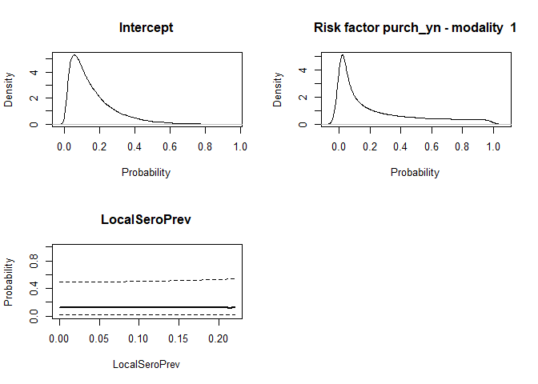

STOCfree: prediction of probabilities of freedom from infection from
longitudinal data
================

The aim of the STOCfree package is to predict herd level probabilities
of freedom from infection from longitudinal data collected as part of
surveillance programmes.

Below, the use of the package is presented through the analysis of a
small dataset collected for the surveillance of infection by the BVDV
virus in cattle.

# Package installation and update

Before installing the package, you need to make sure that JAGS is
installed. This programme can be installed from the following website:
<https://sourceforge.net/projects/mcmc-jags/files/>.

The easiest way to install the `STOCfree` package is from Github. This
requires installing the `devtool` package first.

``` r
install.packages("devtools")
```

Then load the `devtool` package:

``` r
library(devtools)
```

In order to install (or update) the STOCfree package, run the following
line:

``` r
install_github("AurMad/STOCfree")
```

# Attaching packages

The `STOCfree` package needs to be attached.

``` r
library(STOCfree)
```

The list of available functions and datasets can be accessed by typing

``` r
help(package="STOCfree")
```

We also attach the following packages that will be used later:

``` r
library(ggplot2)
```

# Data

The `STOCfree` package contains a dataset called `herdBTM` which
contains the results of antibody ELISA tests performed on bulk tank
milk. Each row is a testing date in a herd. There are 100 herds with 11
tests for each herd.

``` r
head(herdBTM)
```

    ## # A tibble: 6 x 6
    ##   Farm  DateOfTest   ODR TestResult ln_nOrig6_12 LocalSeroPrev
    ##   <chr> <date>     <dbl>      <int>        <dbl>         <dbl>
    ## 1 FR001 2011-09-20  79.2          1            0          0.2 
    ## 2 FR001 2012-01-12  70.5          1            0          0.1 
    ## 3 FR001 2012-09-25  63.9          1            0          0.2 
    ## 4 FR001 2013-02-05  54.2          0            0          0.18
    ## 5 FR001 2013-08-29  75.8          1            0          0.18
    ## 6 FR001 2014-02-04  67.1          1            0          0.12

# Formatting the data for analysis

Herds in the `herdBTM` are tested approximately every 6 months. The
STOCfree model models infection with a montlhy time step. The data used
by the model need to have one row per month. The herdBTM data is
expanded to have one row per month with the `expand_month()` function.

``` r
herdBTM_month <- expand_month(data = herdBTM,
                              herd_colname = Farm,
                              date_colname = DateOfTest,
                              test_res_colname = TestResult)

herdBTM_month
```

    ## # A tibble: 6,224 x 10
    ##    row_id herd_id date__1    month_id Farm  DateOfTest   ODR TestResult
    ##     <int>   <int> <date>        <int> <chr> <date>     <dbl>      <int>
    ##  1      1       1 2011-09-01        2 FR001 2011-09-20  79.2          1
    ##  2      2       1 2011-10-01        3 <NA>  NA          NA           NA
    ##  3      3       1 2011-11-01        4 <NA>  NA          NA           NA
    ##  4      4       1 2011-12-01        5 <NA>  NA          NA           NA
    ##  5      5       1 2012-01-01        6 FR001 2012-01-12  70.5          1
    ##  6      6       1 2012-02-01        7 <NA>  NA          NA           NA
    ##  7      7       1 2012-03-01        8 <NA>  NA          NA           NA
    ##  8      8       1 2012-04-01        9 <NA>  NA          NA           NA
    ##  9      9       1 2012-05-01       10 <NA>  NA          NA           NA
    ## 10     10       1 2012-06-01       11 <NA>  NA          NA           NA
    ## # … with 6,214 more rows, and 2 more variables: ln_nOrig6_12 <dbl>,
    ## #   LocalSeroPrev <dbl>

# Priors

## Test

Prior for tests are stored in a variable called `test_priors`.

``` r
test_priors <- list(
  Se_beta_a = 12,
  Se_beta_b = 2,
  Sp_beta_a = 200,
  Sp_beta_b = 4
)
```

## Infection dynamics

Probability of being infected on the first testing time for a herd and
probability of not eliminating the infection between 2 consecutive
tests.

``` r
infection_priors <- list(
  pi1_beta_a = 1,
  pi1_beta_b = 2,
  tau2_beta_a = 30,
  tau2_beta_b = 2
 )
```

The probability of new infection is modelled as a function of risk
factors using logistic regression. In this example, we use 2 risk
factors. We need priors for both the model intercept and the
coefficients associated with the presence of the risk factors. These
priors are defined with normal distributions on the logit scale. For
each coefficient, we need the mean (`theta_norm_mean` in the code below)
and standard deviation (`theta_norm_sd` in the code below) of these
dsitributions.

``` r
risk_factor_priors <- list(
  theta_norm_mean = c(-2, 0, 0),
  theta_norm_sd = c(1, 2, 2)
)
```

The `plot_priors_rf()` is used to plot the probability distributions
associated with these priors.

``` r
plot_priors_rf(risk_factor_priors)
```

<!-- -->

# STOC free model

## Compiling

The JAGS model is compiled using the `compile_JAGS` function. We just
use 3 herds to test the code. We declare two risk factors of new
infection: `ln_nOrig6_12` and `LocalSeroPrev`. This will result in 3
coefficients associated with the log-odds probability of new infection:
intercept, coefficient for `ln_nOrig6_12` and coefficient for
`LocalSeroPrev`.

``` r
test <- expand_month(data = herdBTM[herdBTM$Farm %in% c("FR001", "FR002", "FR003"),],
                     herd_colname = Farm,
                     date_colname = DateOfTest,
                     test_res_colname = TestResult)

compiled_model <- compile_JAGS(test_data = test, 
             herd_id = herd_id, 
             row_id = row_id,
             month = month_id,
             risk_factors = c("ln_nOrig6_12", "LocalSeroPrev"),
             test_result = TestResult,
             test_priors = test_priors, 
             infection_priors = infection_priors, 
             risk_factor_priors = risk_factor_priors,
             n_chains = 4)
```

    ## Compiling model graph
    ##    Resolving undeclared variables
    ##    Allocating nodes
    ## Graph information:
    ##    Observed stochastic nodes: 32
    ##    Unobserved stochastic nodes: 196
    ##    Total graph size: 1911
    ## 
    ## Initializing model

## Samples from the parameter posterior distributions

Samples from the posterior distributions of model parameters, predicted
probabilities of infection and predicted statuses are drawn using the
`sample_model` function.

``` r
samples <- sample_model(compiled_model, n_burnin = 100, n_iter = 100, n_thin = 5)
```

    ## Warning: Expected 1 pieces. Additional pieces discarded in 240 rows [1, 2, 3, 4,
    ## 5, 6, 7, 8, 9, 10, 11, 12, 13, 14, 15, 16, 17, 18, 19, 20, ...].

    ## Warning in choice_cutoff$pred_ppv[is.nan(choice_cutoff$pred_npv)] <-
    ## choice_cutoff$pred_Se[is.nan(choice_cutoff$pred_ppv)]: le nombre d'objets à
    ## remplacer n'est pas multiple de la taille du remplacement

# Results

The model retruns a list with 2 components:

  - samples from the model parameters posterior distributions
  - samples from the predicted probability of infection posterior
    distributions

## Model parameters

The samples from the model parameter posterior distributions are in the
`parameters` component of the variable in which we have stored the model
results. We put them in a new variable called `param` to explore these
distributions.

``` r
param <- samples$parameters

param
```

    ## # A tibble: 80 x 9
    ##    .chain .iteration .draw    Se    Sp  tau2 theta.1 theta.2 theta.3
    ##     <int>      <int> <int> <dbl> <dbl> <dbl>   <dbl>   <dbl>   <dbl>
    ##  1      1          1     1 0.887 0.991 0.975   -3.65  -5.77   -1.19 
    ##  2      1          2     2 0.934 0.981 0.957   -4.92  -0.430   1.58 
    ##  3      1          3     3 0.832 0.986 0.934   -5.07  -0.908   2.71 
    ##  4      1          4     4 0.942 0.987 0.873   -6.25  -0.666  -5.66 
    ##  5      1          5     5 0.761 0.996 0.992   -5.20  -0.915  -0.385
    ##  6      1          6     6 0.949 0.983 0.941   -4.19  -2.95   -3.23 
    ##  7      1          7     7 0.855 0.985 0.967   -4.46  -2.63    1.96 
    ##  8      1          8     8 0.732 0.975 0.984   -3.85   1.39    0.516
    ##  9      1          9     9 0.787 0.969 0.954   -4.21  -1.04    0.942
    ## 10      1         10    10 0.945 0.990 0.927   -3.78   0.172  -2.34 
    ## # … with 70 more rows

The columns of this dataset are:

  - `.chain`: chain number. Between 1 and 4 in the example because we
    ran 4 MCMC chains in JAGS. This number is the value we selected for
    `n_chains` in the call to `compile_JAGS`.
  - `.iteration`: iteration number. Defined by the n\_iter value in the
    call to sample\_model
  - `.draw`: number of iterations from the first iteration in chain 1,
    pooling all the chains
  - `Se`: sample for sensitivity for this draw
  - `Sp`: sample for pecificity for this draw
  - `tau2`: sample for tau2 for this draw
  - `theta.1`: sample for the logistic model intercept for this draw
  - `theta.2`: sample for the coefficient associated with the first risk
    factor for this draw
  - `theta.3`: sample for the coefficient associated with the second
    risk factor for this draw

<!-- -->

## Probability of infection

The samples from posterior distributions of the predicted probabilities
of infection are in the `proba_inf` component of the variable in which
we have stored the model results. We put them in a new variable called
`proba_inf` to explore these distributions.

``` r
proba_inf <- samples$proba_inf

proba_inf
```

    ## # A tibble: 240 x 6
    ## # Groups:   herd_id [3]
    ##    .chain .iteration .draw herd_id predicted_proba predicted_status
    ##     <int>      <int> <int>   <int>           <dbl>            <dbl>
    ##  1      1          1     1       1        0.0253                  0
    ##  2      1          1     1       2        0.00249                 0
    ##  3      1          1     1       3        0.0253                  0
    ##  4      1          2     2       1        0.00727                 0
    ##  5      1          2     2       2        0.000617                0
    ##  6      1          2     2       3        0.00727                 0
    ##  7      1          3     3       1        0.00622                 0
    ##  8      1          3     3       2        0.00155                 0
    ##  9      1          3     3       3        0.00622                 0
    ## 10      1          4     4       1        0.00192                 0
    ## # … with 230 more rows

The first columns of this dataset are the same as above. The following
columns differ:

  - `herd_id`: herd identifier
  - `predicted_proba`: predicted probability of infection on this draw
  - `predicted_status`: predicted status regarding infection on this
    draw. This status was simulated by using `predicted_proba` for this
    draw as the proportion parameter in a Bernoulli distribution.

Below we represent the densities for the predicted probabilities of
infection for both the draws predicted as infected and the draws
predicted as uninfected. From this, a rule to categorise herds as free
from infection or not needs to be created.

``` r
cols <- hcl(h = c(120, 0), c = 100, l = 85)

ggplot(proba_inf, aes(x = predicted_proba, colour = factor(predicted_status))) +
  geom_density() +
  xlim(0, 1) +
  xlab("Predicted probability of infection") +
  scale_color_manual(labels = c("Uninfected", "Infected"), values = cols) +
  guides(colour = guide_legend(title="Predicted status"))
```

<!-- -->

Below are the probability densities for each of the herds modelled. Each
color represents a herd.

``` r
ggplot(proba_inf, aes(x = predicted_proba, colour = factor(herd_id))) +
  geom_density() +
  xlim(0, 1) +
  xlab("Predicted probability of infection") +
  theme(legend.position="none")
```

<!-- -->

The steps envisonned to categorise herds as free from infection are:

  - define a summary for each density, e.g. 5th percentile of the
    predicted probability of infection
  - choose a cut-off to define freedom from infection, e.g. categorise
    herds with the 5th percentile below 0.1 as free from infection
