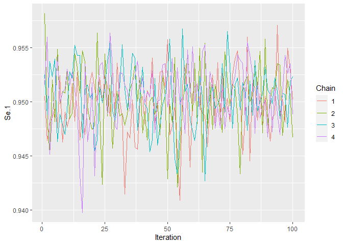
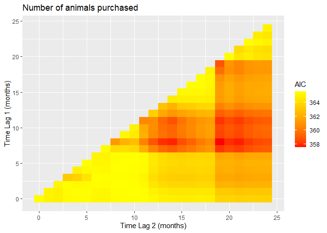
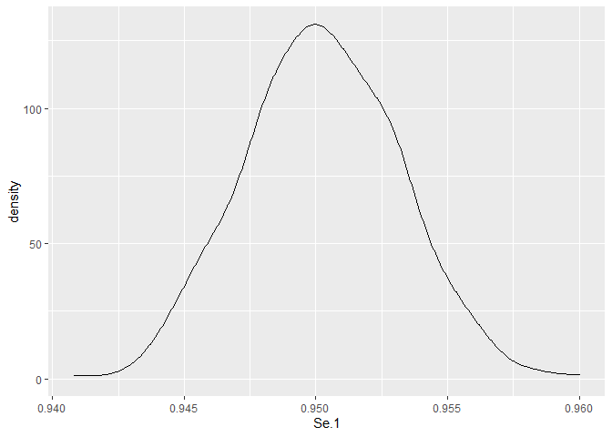
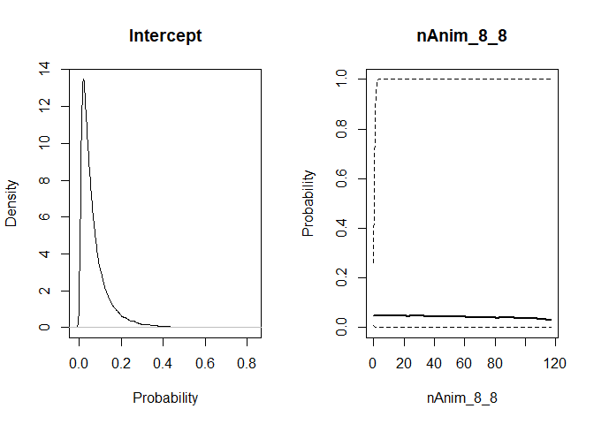

STOCfree: prediction of probabilities of freedom from infection from
longitudinal data
================

  - [Overview](#overview)
  - [Package installation and update](#package-installation-and-update)
  - [Attaching packages](#attaching-packages)
  - [Steps of the analysis](#steps-of-the-analysis)
  - [Test data](#test-data)
  - [Priors for test characteristics](#priors-for-test-characteristics)
  - [Priors for the model parameters related to
    status](#priors-for-the-model-parameters-related-to-status)
  - [Model compilation](#model-compilation)
  - [Model sampling](#model-sampling)
  - [Model results](#model-results)
  - [Inclusion of risk factors](#inclusion-of-risk-factors)
  - [Animal level models](#animal-level-models)

# Overview

The aim of the `STOCfree` package is to predict herd level probabilities
of freedom from infection from longitudinal data collected as part of
surveillance programmes.

It has been developped as part of the EFSA funded project [STOC
free](https://www.stocfree.eu/). An overall description of the project
can be found in a [2019 article by van Roon et
al.](https://www.frontiersin.org/articles/10.3389/fvets.2019.00133/full)
published in frontiers in Veterinary Science.

The problem addressed is the following. For some major infectious
diseases of cattle, there exist local surveillance programmes aimed at
identifying infected herds or animals with the ultimate goal of
controlling or eradicating the disease. Although such programmes usually
lead to disease control or eradication, they can create some difficulty
when trading animals. Herds considered as free from infection within one
programme may not be considered free under another programme. This lack
of comparability can be problematic. This is due to the differences in
the programmes in terms of the frequency of testing, the categories of
the animals tested, the tests used… as well as in the way freedom from
infection is defined from the data collected. The aim of the STOC free
project is to provide a framework allowing the comparison of the outputs
generated by different surveillance programmes. This is known as
output-based surveillance.

In the STOC free project, infection by the Bovine Viral Diarrhea Virus
(BVDV) in cattle is taken as an example. A [description of BVDV
surveillance
programmes](https://www.sciencedirect.com/science/article/pii/S0022030220301697)
in the countries involved in the project was published by van Roon et
al. in the Journal of Dairy Science in 2020 and shows the variety in
existing programmes.

The statistical framework described on this page is meant to model
surveillance programmes in which all herds in the programme are tested
at regular time intervals. The model can be described as a Hidden Markov
Model, running at the month level. The variable of interest is a latent
status regarding infection that is imperfectly measured with tests and
that can be predicted by risk factors. The model returns a herd level
posterior distribution for the probability of being status positive
given a sequence of test results and risk factor occurrence. This
probability of being positive to the status (usually infection) is
predicted for the last month in the dataset. Data collected before is
used as historical data to train the model. Risk factors of new
infection (more broadly of becoming status positive) are considered. The
model is run in a Bayesian framework with estimation and prediction
performed in [JAGS](http://mcmc-jags.sourceforge.net/).

Depending on the input, the details of the model can be different.
Specifying different types of input will lead to different functions
being called internally. Currently, the following types of inputs can be
modelled:

  - Herd level test results, 1 test, no risk factors
  - Herd level test results, 1 test, several risk factors
  - Herd level test results, several tests, no risk factors
  - Herd level test results, several tests, several risk factors
  - Animal level test results, one test, no risk factors
  - Animal level test results, several tests, several risk factors

The next sections describe how to install the package, set up and run
the model.

# Package installation and update

Before installing the package, you need to make sure that JAGS is
installed. This programme can be installed from the following website:
<https://sourceforge.net/projects/mcmc-jags/files/>.

The easiest way to install the `STOCfree` package is from Github. This
requires installing the `devtool` package first. You will need R version
3.6 or later to install the package. You may be asked to install or
update several packages during the installation.

``` r
install.packages("devtools")
```

Then load the `devtool` package:

``` r
library(devtools)
```

In order to install (or update) the STOCfree package, run the following
line:

``` r
install_github("AurMad/STOCfree")
```

# Attaching packages

The `STOCfree` package needs to be attached.

``` r
library(STOCfree)
```

The list of available functions and datasets can be accessed by typing

``` r
help(package="STOCfree")
```

We also attach the following packages that will be used later:

``` r
library(ggplot2)
```

# Steps of the analysis

Modelling will usually consist in the following steps:

1.  Set up the test data
2.  Define the priors for test characteristics
3.  Define the priors for the model parameters related to status
4.  Set up the risk factor data
5.  Define the priors for the association between risk factors and
    probability of becoming infected (status positive)
6.  Compile the JAGS model
7.  Sample from the JAGS model
8.  Analyse the model outputs

# Test data

## Example dataset

We demonstrate the use of the package by using a toy dataset called
`herdBTM` which is included in the package. This dataset contains the
results of tests performed in 100 herds. Two different tests are used.
The first test is an antibody ELISA performed on bulk tank milk. When
this test is positive, a confirmatory test with a high specificity is
performed one month later. The result of the ELISA test is an optical
density ratio (continuous) which is converted into a negative or
positive test result based on a threshold of 35. The dataset looks as
follows:

``` r
head(herdBTM)
```

    ## # A tibble: 6 x 6
    ##   Farm  DateOfTest   ODR Test    TestResult LocalSeroPrev
    ##   <chr> <date>     <dbl> <chr>        <dbl>         <dbl>
    ## 1 FR001 2014-02-04  67.1 BTM_ODR          1          0.12
    ## 2 FR001 2014-03-01  NA   confirm          1          0.12
    ## 3 FR001 2014-09-10  54.4 BTM_ODR          1          0.1 
    ## 4 FR001 2014-10-01  NA   confirm          1          0.1 
    ## 5 FR001 2015-02-01  47.1 BTM_ODR          1          0.08
    ## 6 FR001 2015-03-01  NA   confirm          1          0.08

The columns of the dataset correspond to:

  - `Farm`: farm ID
  - `DateOfTest`: date when the test was performed
  - `ODR`: optical density ratio associated with ELISA test
  - `Test`: type of test used, either routine ELISA on bulk tank milk
    (“BTM\_ODR”) or confirmatory test (“confirm”)
  - `TestResult`: test result. 0 for negative; 1 for positive
  - `LocalSeroPrev`: local seroprevalence, a risk factor of new
    infection

## `STOCfree_data` objects

All the later analyses rely on the construction of a `STOCfree_data`
object. As an example, a `STOCfree_data` object is constructed from the
`herdBTM` dataset. To create this object, we use the `STOCfree_data()`
function. Type `?STOCfree_data` in the console to see the list of
arguments that can be used.

``` r
sfd <- STOCfree_data(test_data = herdBTM,
                     test_herd_col = "Farm",
                     test_date_col = "DateOfTest",
                     test_res_col = "TestResult",                     ,
                     test_name_col = "Test",
                     test_level = "herd")
```

The function returns an object of class `STOCfree_data`. The
`herd_ntests` subclass implies that the tests are performed at the herd
level, than more than one test is used and that no risk factor is
included. The subclass is used for method dispatch later on.

``` r
class(sfd)
```

    ## [1] "herd_ntests"   "STOCfree_data"

A `STOCfree_data` object is in fact a list of `data.frames`. Below we
provide a brief explanation on the content of this list.

``` r
str(sfd)
```

    ## List of 8
    ##  $ var_names       : Named chr [1:4] "Farm" "DateOfTest" "TestResult" "Test"
    ##   ..- attr(*, "names")= chr [1:4] "test_herd_col" "test_date_col" "test_res_col" "test_name_col"
    ##  $ herd_id_corresp :'data.frame':    100 obs. of  2 variables:
    ##   ..$ Farm   : chr [1:100] "FR001" "FR002" "FR003" "FR004" ...
    ##   ..$ herd_id: int [1:100] 1 2 3 4 5 6 7 8 9 10 ...
    ##  $ test_data       :'data.frame':    917 obs. of  5 variables:
    ##   ..$ status_id: int [1:917] 1 2 8 9 13 14 20 21 25 26 ...
    ##   ..$ herd_id  : num [1:917] 1 1 1 1 1 1 1 1 1 1 ...
    ##   ..$ month_id : num [1:917] 1 2 8 9 13 14 20 21 25 26 ...
    ##   ..$ test_id  : int [1:917] 1 2 1 2 1 2 1 2 1 2 ...
    ##   ..$ test_res : num [1:917] 1 1 1 1 1 1 1 0 1 0 ...
    ##  $ herd_test_data  :'data.frame':    100 obs. of  6 variables:
    ##   ..$ herd_id     : int [1:100] 1 2 3 4 5 6 7 8 9 10 ...
    ##   ..$ ind_i       : int [1:100] 1 34 67 100 133 166 199 232 265 298 ...
    ##   ..$ ind_j       : int [1:100] 2 35 68 101 134 167 200 233 266 299 ...
    ##   ..$ ind_f       : int [1:100] 32 65 98 131 164 197 230 263 296 329 ...
    ##   ..$ ind_p       : int [1:100] 33 66 99 132 165 198 231 264 297 330 ...
    ##   ..$ last_is_test: num [1:100] 0 1 0 1 1 1 1 1 0 0 ...
    ##  $ test_perf_prior :'data.frame':    2 obs. of  6 variables:
    ##   ..$ test   : chr [1:2] "BTM_ODR" "confirm"
    ##   ..$ test_id: int [1:2] 1 2
    ##   ..$ Se_a   : logi [1:2] NA NA
    ##   ..$ Se_b   : logi [1:2] NA NA
    ##   ..$ Sp_a   : logi [1:2] NA NA
    ##   ..$ Sp_b   : logi [1:2] NA NA
    ##  $ risk_factors    :'data.frame':    1 obs. of  4 variables:
    ##   ..$ risk_factor: chr "Intercept"
    ##   ..$ type       : chr "intercept"
    ##   ..$ modality   : logi NA
    ##   ..$ ref        : num 0
    ##  $ risk_factor_data:'data.frame':    3300 obs. of  4 variables:
    ##   ..$ status_id: int [1:3300] 1 2 3 4 5 6 7 8 9 10 ...
    ##   ..$ herd_id  : num [1:3300] 1 1 1 1 1 1 1 1 1 1 ...
    ##   ..$ month_id : num [1:3300] 1 2 3 4 5 6 7 8 9 10 ...
    ##   ..$ intercept: num [1:3300] 1 1 1 1 1 1 1 1 1 1 ...
    ##  $ inf_dyn_priors  : Named logi [1:6] NA NA NA NA NA NA
    ##   ..- attr(*, "names")= chr [1:6] "pi1_a" "pi1_b" "tau1_a" "tau1_b" ...
    ##  - attr(*, "level")= chr "herd"
    ##  - attr(*, "number of herds")= int 100
    ##  - attr(*, "number of tests")= int 2
    ##  - attr(*, "month first test")= chr "2014-02"
    ##  - attr(*, "month last test")= chr "2016-10"
    ##  - attr(*, "number of risk factors")= num 0
    ##  - attr(*, "class")= chr [1:2] "herd_ntests" "STOCfree_data"

The list components are:

  - `var_names`: correspondence between column names in the original
    datasets and relevant data used in the models
  - `herd_id_corresp`: for the analysis herds are numbered from 1 to the
    number of herds. This table contains the correspondence between
    these IDs and the original IDs
  - `test_data`: data with test results
  - `herd_test_data`: herd level indices in the sequence of all months
    for all herds used in the model. For each herd, the model needs the
    indices associated with the first, second, penultimate and last
    tests in the sequence.
  - `test_perf_prior`: table with parameters for the prior distributions
    for test characteristics.
  - `risk_factors`: list and type of risk factors that will be included
    in the model
  - `risk_factor_data`: dataset containing risk factor values for all
    herds and all months in the analysis
  - `inf_dyn_priors`: table with priors for infection dynamics:
    probability of being status positive on the first month, probability
    of becoming status positive between consecutive months when
    applicable, probability of not eliminating the infection between
    consecutive months

# Priors for test characteristics

The model accounts for the fact that the sensitivity and specificty of
the different tests used can be below 1. Hypotheses about these
parameters are included through the use of Beta distributions as priors
for the different sensitivities and specificities. We can check the
current values for the parameters associated with these disitrbutions
using the `show_tests()` function.

``` r
show_tests(sfd)
```

    ##      test test_id Se_a Se_b Sp_a Sp_b
    ## 1 BTM_ODR       1   NA   NA   NA   NA
    ## 2 confirm       2   NA   NA   NA   NA

Column names ending with `_a` and `_b` contain the alpha and beta values
for Beta distributions. For example `Se_a = 20` and `Se_b = 2` define
the prior distribution for sensitivity as Se \~ Beta(20, 2).

As can be seen, no value has been defined yet. This can be done as
follows:

``` r
sfd <- set_priors_tests(sfd,
                 test = "BTM_ODR",
                 Se_a = 5000,
                 Se_b = 260,
                 Sp_a = 20,
                 Sp_b = 2)

sfd <- set_priors_tests(sfd,
                 test = "confirm",
                 Se_a = 20,
                 Se_b = 2,
                 Sp_a = 10000,
                 Sp_b = 1)
```

We can check that the priors have changed:

``` r
show_tests(sfd)
```

    ##      test test_id Se_a Se_b  Sp_a Sp_b
    ## 1 BTM_ODR       1 5000  260    20    2
    ## 2 confirm       2   20    2 10000    1

The prior distributions can be plotted with the `plot_priors_tests()`
function.

``` r
plot_priors_tests(sfd)
```

<!-- -->

In order to help selecting appropriate parameter values for the Beta
distributions, we have designed a Shiny app which is available from
Github. See <https://github.com/AurMad/betadistapp>

# Priors for the model parameters related to status

These parameters are the probability of being status positive on the
first time step (pi1), the probability of becoming status positive
between consecutive months (tau1) and the probability of remaining test
positive between consecutive months (tau2). When risk factors are
included in the model, tau1 is modelled as a function of these risk
factors and the paramters for the prior distribution of tau1 will not be
taken into account.

``` r
show_inf_dyn(sfd)
```

    ##  pi1_a  pi1_b tau1_a tau1_b tau2_a tau2_b 
    ##     NA     NA     NA     NA     NA     NA

Parameter values are provided for these prior distributions as follows:

``` r
sfd <- set_priors_inf_dyn(sfd,
                   pi1_a = 1,
                   pi1_b = 1,
                   tau1_a = 1.5, 
                   tau1_b = 10,
                   tau2_a = 10, 
                   tau2_b = 1.5)
```

These distributions can be plotted.

``` r
plot_priors_inf_dyn(sfd)
```

<!-- -->

# Model compilation

This step consists in compiling the JAGS model associated with the
`STOCfree_data` object we have created.

The object created above contains no risk factor. We could have compiled
a model including risk factors directly, but we want to go into detail
about how to select risk factors below. Our aim here was therefore to
separate the model compilation and sampling, which will be the same
regardless of risk factor presence, from the steps that are specific to
risk factors.

Compilation of the JAGS model is done as follows:

``` r
compiled_model <- compile_JAGS(sfd, 
                               n_chains = 3)
```

    ## Compiling model graph
    ##    Resolving undeclared variables
    ##    Allocating nodes
    ## Graph information:
    ##    Observed stochastic nodes: 817
    ##    Unobserved stochastic nodes: 3406
    ##    Total graph size: 22348
    ## 
    ## Initializing model

# Model sampling

Sampling from the parameter posterior distributions is done using the
`sample_model()` function. This function takes as arguments a compiled
model as created in the previous section, a number of burnin iterations,
a number of sampling ietrations and a thinning interval (1 in `n_thin`
iterations stored).

``` r
samples <- sample_model(compiled_model, 
                        n_burnin = 100, 
                        n_iter = 100, 
                        n_thin = 5)
```

    ## Burnin (100 iterations)

    ## Sampling (100 iterations)

# Model results

## Structure of the returned object

The model returns a list containing 3 `data.frames`. These data.frames
were constructed from the JAGS MCMC draws and reformatted using the
`spread_draws()` function from the `tidybayes` package.

  - `parameters`: MCMC draws for the sensitivities, specificities, tau1
    (when applicable), tau2 and risk factor related parameters
  - `proba_inf`: predicted probability of being status positive on the
    month of surveillance (last month with test results in the dataset)
  - `choice_cutoff`: for later use. Should be ignored for now.

<!-- end list -->

``` r
str(samples, 
    max.level = 2)
```

    ## List of 3
    ##  $ parameters   :Classes 'tbl_df', 'tbl' and 'data.frame':   60 obs. of  9 variables:
    ##   ..$ .chain    : int [1:60] 1 1 1 1 1 1 1 1 1 1 ...
    ##   ..$ .iteration: int [1:60] 1 2 3 4 5 6 7 8 9 10 ...
    ##   ..$ .draw     : int [1:60] 1 2 3 4 5 6 7 8 9 10 ...
    ##   ..$ Se.1      : num [1:60] 0.942 0.944 0.953 0.948 0.95 ...
    ##   ..$ Se.2      : num [1:60] 0.859 0.889 0.879 0.865 0.85 ...
    ##   ..$ Sp.1      : num [1:60] 0.973 0.982 0.986 0.98 0.982 ...
    ##   ..$ Sp.2      : num [1:60] 1 1 1 1 1 ...
    ##   ..$ tau1      : num [1:60] 0.0276 0.0326 0.0315 0.0256 0.0303 ...
    ##   ..$ tau2      : num [1:60] 0.978 0.978 0.981 0.981 0.975 ...
    ##  $ proba_inf    :Classes 'grouped_df', 'tbl_df', 'tbl' and 'data.frame': 6000 obs. of  6 variables:
    ##   ..$ .chain          : int [1:6000] 1 1 1 1 1 1 1 1 1 1 ...
    ##   ..$ .iteration      : int [1:6000] 1 1 1 1 1 1 1 1 1 1 ...
    ##   ..$ .draw           : int [1:6000] 1 1 1 1 1 1 1 1 1 1 ...
    ##   ..$ herd_id         : int [1:6000] 1 2 3 4 5 6 7 8 9 10 ...
    ##   ..$ predicted_proba : num [1:6000] 0.0276 0.5016 0.0276 1 1 ...
    ##   ..$ predicted_status: num [1:6000] 0 0 0 1 1 1 1 1 0 0 ...
    ##   ..- attr(*, "groups")=Classes 'tbl_df', 'tbl' and 'data.frame':    100 obs. of  2 variables:
    ##   .. ..- attr(*, ".drop")= logi TRUE
    ##  $ choice_cutoff:'data.frame':   101 obs. of  5 variables:
    ##   ..$ cutoff  : num [1:101] 0 0.01 0.02 0.03 0.04 0.05 0.06 0.07 0.08 0.09 ...
    ##   ..$ pred_Se : num [1:101] 1 1 1 0.991 0.984 ...
    ##   ..$ pred_Sp : num [1:101] 0 0.00319 0.02037 0.57069 0.93251 ...
    ##   ..$ pred_ppv: num [1:101] 1 0.583 0.588 0.763 0.953 ...
    ##   ..$ pred_npv: num [1:101] NaN 1 1 0.979 0.976 ...

It may be easier to store these tables in separate objects.

``` r
parameters <- samples$parameters
proba_inf  <- samples$proba_inf
```

When running a model using a large dataset, it is recommended to store
`parameters` and `proba_inf` data, as csv files for example.

``` r
write.csv(samples$parameters, 
          "parameters.csv", 
          row.names = FALSE)

write.csv(samples$proba_inf, 
          "proba_inf.csv", 
          row.names = FALSE)
```

These results can be loaded back easily:

``` r
parameters <- read.csv("parameters.csv")
proba_inf  <- read.csv("proba_inf.csv")
```

Each table contains the 3 following columns:

  - `.chain`: chain number. Between 1 and 3 in the example because we
    ran 3 MCMC chains in JAGS. This number is the value we selected for
    `n_chains` in the call to `compile_JAGS()`.
  - `.iteration`: iteration number. Defined by the `n_iter` value in the
    call to `sample_model()`
  - `.draw`: number of iterations from the first iteration in chain 1,
    pooling all the chains

## Assessing convergence

The results are formatted in a way that facilitates their graphical
analysis with `ggplot()` from the `ggplot2` package. It is
straightforward to check the traceplots for the variables of interest.
Given the small number of herds and the small number of iterations, the
plot below does not look as it should to indicate that convergence has
been reached.

``` r
ggplot(parameters, 
       aes(x = .iteration,
           y = Se.1, col = factor(.chain))) +
  geom_line()
```

<!-- -->

## Plotting posterior densities

It is also straightforward to plot the posterior densities of the
different variables of interest.

  - Posterior density for the sensitivity of test 1

<!-- end list -->

``` r
ggplot(parameters, aes(x = Se.1)) +
  geom_density()
```

<!-- -->

  - Posterior density for the predicted probability of being status
    positive on the month of surveillance

<!-- end list -->

``` r
ggplot(proba_inf, 
       aes(x = predicted_proba)) +
  geom_density()
```

<!-- -->

  - Posterior density for the predicted probability of being status
    positive on the month of surveillance for a given herd

<!-- end list -->

``` r
herd <- 1

ggplot(proba_inf[proba_inf$herd_id == herd,], 
       aes(x = predicted_proba)) +
  geom_density()
```

<!-- -->

# Inclusion of risk factors

Risk factors are included with the objective of detecting infection
earlier when the interval between tests is long, as is usually the case.
They can also improve the performance of the prediction of the
probability of being status positive when test performance is not good.

The association between the probablity of becoming status positive
(tau1) and risk factors is modelled with logistic regression. The
uncertainty in status as measured by test result is accounted for in the
regression through test sensitivity and specificity.

## Selection of risk factors to include in the Bayesian model

Bayesian inference in JAGS can take a lot of time. This time increases
with the size of the dataset modelled as well as with the number of MCMC
iterations. One way to overcome this problem is to force covariates in
the model based on what is known about the disease. In this case, ut is
also possible to include informative prior distributions for the
coefficients of the logistic regression between tau1 and risk factors.

The STOCfree package contains a set of functions designed to help in the
selection of risk factors from the data. For this purpose, it is
considered that all herds with a negative test result are eligible for
becoming test positive on the next test. The probability of becoming
test positive (versus remaining test negative) is modelled with logistic
regression. A further thing that is considered is the fact that risk
factors occurring at one point in time may be associated with becoming
test positive later.

To show how to use the available functions, we use the `intro` dataset
which is included in the package.

``` r
intro
```

    ## # A tibble: 1,324 x 3
    ##    Farm  dateIntr   nAnim
    ##    <chr> <fct>      <int>
    ##  1 FR001 2010-01-22     1
    ##  2 FR001 2015-05-04    14
    ##  3 FR002 2011-02-11     2
    ##  4 FR002 2010-12-23     5
    ##  5 FR003 2012-11-07     3
    ##  6 FR003 2016-05-25     5
    ##  7 FR005 2016-03-31    13
    ##  8 FR005 2016-04-20    17
    ##  9 FR008 2012-06-04     2
    ## 10 FR008 2010-04-30     1
    ## # … with 1,314 more rows

This dataset contains the number of animals purchased as well as the
dates of introduction for the 100 herds in the `herdBTM` data. Using
these datasets, the probability of seroconversion (becoming test
positive between 2 tests in a given herd) is modelled as a function of
the number of animals purchased between the month of seroconversion
(month 0) and 24 months earlier. The time of seroconversion is taken as
the midpoint between the 2 test dates considered.

``` r
nAnim_lagged <- logit_nwinf_lagged(
  sf_data = sfd,
  rf_data = intro,
  rf_date_col = "dateIntr",
  rf_col = "nAnim",
  time_of_inf = "mid",
  lag1 = 0,
  lag2 = 24)
```

The function returns a table with the AICs of all the models evaluated.

``` r
str(nAnim_lagged)
```

    ## 'data.frame':    325 obs. of  4 variables:
    ##  $ lag1: int  0 0 1 0 1 2 0 1 2 3 ...
    ##  $ lag2: int  0 1 1 2 2 2 3 3 3 3 ...
    ##  $ l   : int  0 1 0 2 1 0 3 2 1 0 ...
    ##  $ AIC : num  351 351 351 351 351 ...
    ##  - attr(*, "out.attrs")=List of 2
    ##   ..$ dim     : Named int  25 25 1 1
    ##   .. ..- attr(*, "names")= chr  "lag1" "lag2" "l" "AIC"
    ##   ..$ dimnames:List of 4
    ##   .. ..$ lag1: chr  "lag1= 0" "lag1= 1" "lag1= 2" "lag1= 3" ...
    ##   .. ..$ lag2: chr  "lag2= 0" "lag2= 1" "lag2= 2" "lag2= 3" ...
    ##   .. ..$ l   : chr "l=NA"
    ##   .. ..$ AIC : chr "AIC=NA"

This can be plotted using the code below. From the Figure below it can
be seen that between the worst (AIC \> 350) and the best (AIC \< 342)
model, the difference in AIC is rather limited. There is a drop in AIC
for intervals starting from 8 months before seroconversion.

``` r
ggplot(data = nAnim_lagged, aes(x = lag2, y = lag1, fill = AIC)) +
  geom_tile() +
  xlab("Time Lag 2 (months)") +
  ylab("Time Lag 1 (months)") +
  scale_fill_gradient(low = "red", high = "yellow", aesthetics = "fill") +
  ggtitle("Number of animals purchased")
```

<!-- -->

When the function is used to evaluate several candidate variables, all
these variables can be incldued in a multivariate logistic model. For
this, we create a dataset with the different variables of interest.

  - Model outcome

<!-- end list -->

``` r
nwinf <- make_nwinf_data(sfd, 
                         time_of_inf = "mid")
```

  - Covariates

Here, we include the number of animals purchased 8 months before the
test of interest. This is done by calling the `add_risk_factor()`.

``` r
nwinf <- add_risk_factor(nwinf,
                         intro,
                         rf_col = "nAnim",
                         rf_date_col = "dateIntr",
                         lag1 = 8,
                         lag2 = 8)
```

  - Model

The multivariate logistic model is setimated with R `glm()` function
called by `logit_nwinf()` function from the `STOCfree` package:

``` r
modl <- logit_nwinf(nwinf, 
                    risk_factors = "nAnim_8_8")
```

The model results are:

``` r
summary(modl)
```

    ## 
    ## Call:
    ## glm(formula = formula, family = binomial(link = "logit"), data = data)
    ## 
    ## Deviance Residuals: 
    ##     Min       1Q   Median       3Q      Max  
    ## -1.4976  -0.7735  -0.7735   1.3253   1.6448  
    ## 
    ## Coefficients:
    ##             Estimate Std. Error z value Pr(>|z|)    
    ## (Intercept) -1.05356    0.13787  -7.642 2.14e-14 ***
    ## nAnim_8_8    0.17808    0.06602   2.697  0.00699 ** 
    ## ---
    ## Signif. codes:  0 '***' 0.001 '**' 0.01 '*' 0.05 '.' 0.1 ' ' 1
    ## 
    ## (Dispersion parameter for binomial family taken to be 1)
    ## 
    ##     Null deviance: 347.40  on 292  degrees of freedom
    ## Residual deviance: 339.08  on 291  degrees of freedom
    ## AIC: 343.08
    ## 
    ## Number of Fisher Scoring iterations: 4

## Inclusion of risk factors in the Bayesian model

The `STOCfree_data()` object is updated to include the risk factors
selected for the analysis. This is done with the `sf_add_risk_factor()`
function.

``` r
sfd <- sf_add_risk_factor(
  sfd = sfd,
  risk_factor_data = intro,
  risk_herd_col = "Farm",
  risk_date_col = "dateIntr",
  risk_factor_col = "nAnim",
  risk_factor_type = "continuous",
  lag1 = 8,
  lag2 = 8,
  FUN = sum)
```

Doing this will result in the priors required for infection related
parameters to be different from above. The priors for tau1 are not
needed anymore. They are replaced by prior distributions for the
logistic regression.

``` r
show_inf_dyn(sfd)
```

    ##  pi1_a  pi1_b tau2_a tau2_b 
    ##    1.0    1.0   10.0    1.5

## Priors for the logistic regression

The Bayesian model models the probability of becoming status positive
(usually getting infected) as a function of one or several risk factors,
with logistic regression. Priors for the coefficients in the logistic
regression need to be provided. The prior distributions used are normal
distributions on the logit scale. In our case, we need to provide prior
distributions for the intercept as well as for coefficient associated
with the number of animals purchased 8 months before the month of
surveillance. Below is the list of covariates included in the
`STOCfree_data` so far.

``` r
show_rf(sfd)
```

    ##   risk_factor       type modality ref
    ## 1   Intercept  intercept       NA   0
    ## 2   nAnim_8_8 continuous       NA   0

``` r
sfd <- set_priors_rf(sfd,
                   risk_factor = "Intercept",
                   mean = -3, sd = 1)


sfd <- set_priors_rf(sfd,
                   risk_factor = "nAnim_8_8",
                   mean = 0, sd = 2)
```

This has updated the list of covariates with the normal distribution
parameters.

``` r
show_rf(sfd)
```

    ##   risk_factor       type modality ref mean_prior sd_prior
    ## 1   Intercept  intercept       NA   0         -3        1
    ## 2   nAnim_8_8 continuous       NA   0          0        2

These priors can be plotted on the probability scale. The prior
distribution for the intrcept implies that in herds buying no cows, the
probability of becoming positive is most likely below 0.4, with most of
the density below 0.2.

``` r
plot_priors_rf(sfd)
```

<!-- -->

## Running the Bayesian model

This is done as explained above by calling first the `compile_JAGS()`
and then the `sample_model()` functions. In this case, estimates for the
logistic regression parameters will appear as theta.1 (model intercept)
and theta.2 (coefficient for the nAnim\_8\_8 variable).

# Animal level models

When test results are available at the animal level, the model works
slightly differently. In this case, the probability of infection is
still at the herd level, but in infected herds, the number of positives
follows a binomial distribution: n\_positives \~ Binomial(pi\_within,
n\_tested). pi\_within represents the proportion of infected animals in
infected herds.
